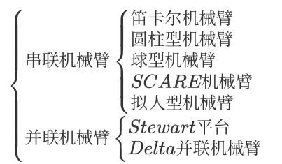
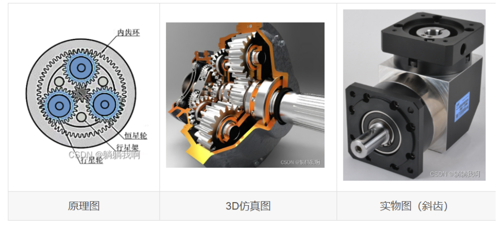
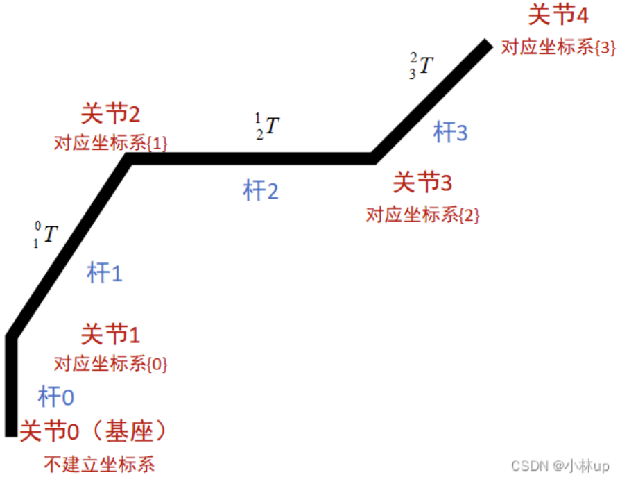
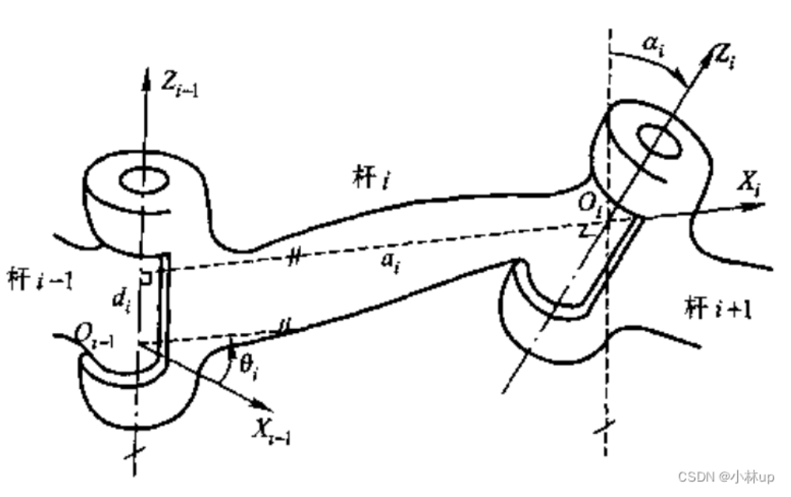
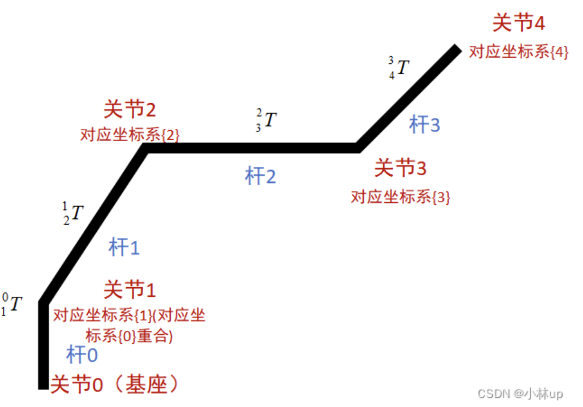
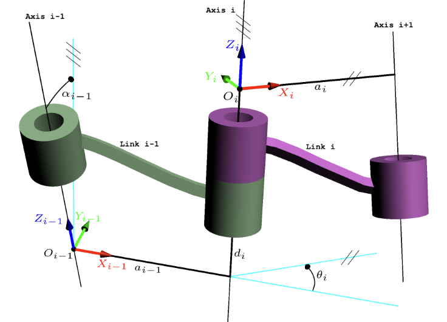
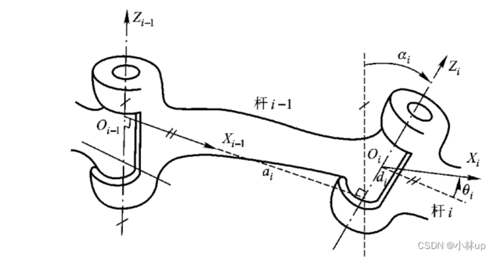
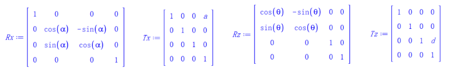

## 1. 基础知识

### 1.1. 机械臂的机械结构

1. 导图：



1. [机械臂速成小指南（三）：机械臂的机械结构-CSDN 博客](https://blog.csdn.net/m0_53966219/article/details/125391772)

### 1.2. 减速机

1. 减速机是提高机械臂关节运行精度及扭矩的重要部件，常见的减速器有行星减速机、摆线针轮减速机、谐波减速机及 RV 减速机。
2. **行星减速机**
   

   - 体积小、重量轻，承载能力高，使用寿命长、运转平稳，噪声低，功率分流、多齿啮合独用。
   - 减速比：i=\frac{n_2}{n_1}，n_2 为行星轮齿数、n_1 为恒星轮齿数
3. [机械臂速成小指南（四）：减速机-CSDN 博客](https://blog.csdn.net/m0_53966219/article/details/125461713?spm=1001.2014.3001.5501)

### 1.3. 末端执行器

[机械臂速成小指南（五）：末端执行器-CSDN 博客](https://blog.csdn.net/m0_53966219/article/details/125509910?spm=1001.2014.3001.5501)

### 1.4. 位姿描述方法

[8 分钟带你彻底弄懂《线性代数》-CSDN 博客](https://blog.csdn.net/Neutionwei/article/details/109698699)

[【官方双语/合集】线性代数的本质 - 系列合集_bilibili](https://www.bilibili.com/video/BV1ys411472E/?spm_id_from=333.1387.collection.video_card.click&vd_source=f2a5b4f4183172b5a7e532e1e87d7f5a)

[【数学】线性代数知识点总结-CSDN 博客](https://blog.csdn.net/weixin_52924460/article/details/142375463)

[机械臂速成小指南（七）：机械臂位姿的描述方法-CSDN 博客](https://blog.csdn.net/m0_53966219/article/details/125534210)

### 1.5. 小指南

[机械臂速成小指南- 文集 哔哩哔哩专栏](https://www.bilibili.com/read/readlist/rl580997?spm_id_from=333.1369.opus.module_collection.click)

### 1.6. 线代相关知识

- 向量与矩阵基础：加减、乘法、内积、叉积（用于旋转）
- 逆矩阵、转置、行列式（逆向运动学需求解方程，行列式用高斯消元法，逆矩阵用高斯-若尔当消元法）
- 齐次坐标与变换矩阵：将平移和旋转统一为 4x4 矩阵，这是 DH 法的核心
- 旋转矩阵（SO(3)群）、欧拉角或四元数简介（姿态表示，避免万向节锁）
- 可跳过：线性方程组求解（MatLab 可代劳）、特征向量（除非涉及动力学）
- [MIT 线性代数 - Gilbert Strang](https://www.bilibili.com/video/BV1ix411f7Yp) ：先看 3B1B 的《线性代数的本质》，然后看 Gilbert Strang 教授的课程 1~3 节、5-10 节、14-15 节、17-20 节、30-32 节
- 齐次变换矩阵：由旋转矩阵 R_{3\times3} 和平移矩阵 P_{3\times1} 合成而成，第四行则补齐为方阵

  - ```
                                                ^A_B{T}=\begin{bmatrix} R_{3\times3} & P_{3\times1} \\ 0_{1\times3} & 1 \end{bmatrix}
    ```
  - 链式法则：如果有底座到关节 1 的变换 ^0_1{T} 和关节 1 到关节 2 的变换 ^1_2{T} ，则底座到关节 2 的变换 ^0_2{T}=^0_1{T}^1_2{T}

## 2. DH 参数法

### 2.1. 传统 DH 参数法

1. **坐标系定义规则**：

   - 杆 i 的近端是关节 i，远端是关节 i+1（关节 i 轴称为杆 i 驱动轴，关节 i+1 轴称为杆 i 传动轴）
     
   - 确定各坐标系的 z 轴：选取 Z_i 轴沿关节 i+1 的轴向，各平行 Z 轴指向一致
   - 确定各坐标系的原点 O：选取原点 O_i 在过 Z_{i-1}轴和 Z_i 轴的公法线上，即此 Z_{i-1}与 Z_i 轴的交点
   - 确定各坐标系的 x 轴：选取 X_i 轴沿过 Z_{i-1}轴和 Z_i 轴的公法线，方向由 Z_{i-1}指向 Z_i
   - 确定各坐标系的 y 轴：Y_i=Z_i\times X_i，即构成右手坐标系，细节看下图
2. **DH 参数定义**：
   

   - 杆件长度 a_i：从 Z_{i-1}轴到 Z_i 轴的距离，沿 X_i 的指向为正
   - 杆件扭角\alpha_i：从 Z_{i-1}轴到 Z_i 轴的转角，绕 X_i 轴正向转动为正（螺旋定则），\alpha_i\in(-\pi,+\pi]
   - 关节距离 d_i：从 X_{i-1}轴到 X_i 轴的距离，沿 Z_{i-1}轴的指向为正
   - 关节转角\theta_i：从 X_{i-1}轴到 X_i 轴的转角，绕 Z_{i-1}轴正向转动为正，\theta_i\in(-\pi,+\pi]
3. **细节**：
   [机器人学：DH 参数总结（传统 DH 方法和改进 DH 方法）-CSDN 博客](https://blog.csdn.net/subtitle_/article/details/130982929)
   [机器人学 DH 参数及利用 matlab 符号运算推导-CSDN 博客](https://blog.csdn.net/subtitle_/article/details/125467306)

### 2.2. 改进 DH 参数法

1. 传统 DH 参数法问题：**对于树形结构或含闭链的机器人，有的杆上会存在多于一个传动轴，这时用传统 D-H 参数法建立杆坐标系时会产生歧义**
2. **坐标系定义规则**：

   - 杆 i 的近端是关节 i，远端是关节 i+1（关节 i 轴称为杆 i 驱动轴，关节 i+1 轴称为杆 i 传动轴）
     
   - 确定各坐标系的原点 O：关节轴 i、i+1 的公垂线与关节轴 i 的交点
   - 确定各坐标系的 z 轴：沿关节 i 的轴向为 Z_i 轴，各平行 Z 轴指向一致
   - 确定各坐标系的 x 轴：过原点及 Z_{i} 轴和 Z_{i+1} 轴的公垂线为 X_i 轴，方向由 Z_{i} 指向 Z_{i+1}
   - 确定各坐标系的 y 轴：Y_i=Z_i\times X_i，即构成右手坐标系，细节看下图
   - 注意事项：如果 Z_i 与 Z_{i+1} 相交导致无法确定 X_i 轴方向，则取 X_i=Z_i \times Z_{i+1}；如重合，则 X 轴垂直且一致即可
     
3. **DH 参数定义**：
   

   - 杆件长度 a_i：从 Z_{i}轴到 Z_{i+1}轴的距离，沿 X_{i}的指向为正
   - 杆件扭角\alpha_i：从 Z_{i}轴到 Z_{i+1}轴的旋转角读，绕 X_{i}轴正向转动为正（螺旋定则），\alpha_i\in(-\pi,+\pi]
   - 关节距离 d_i：从 X_{i-1}轴到 X_i 轴的距离，沿 Z_{i}轴的指向为正
   - 关节转角\theta_i：从 X_{i-1}轴到 X_i 轴的转角，绕 Z_{i}轴正向转动为正，\theta_i\in(-\pi,+\pi]
4. **细节**：
   [标准 DH 建模与改进 DH 建模_standard dh-CSDN 博客](https://blog.csdn.net/qq_21834027/article/details/85206561)
   [机器人学 DH 参数及利用 matlab 符号运算推导-CSDN 博客](https://blog.csdn.net/subtitle_/article/details/125467306)
5. **齐次变换矩阵计算顺序：**
6. ```
       ^{i-1}_i{T} &= &R_X(\alpha_{i-1})T_X(a_{i-1})R_Z(\theta_i)T_Z(d_i) \\ &= &\begin{bmatrix} cos(\theta_i) & -sin(\theta_i) & 0 & a_{i-1} \\ cos(\alpha_{i-1})sin(\theta_i) & cos(\alpha_{i-1})cos(\theta_i) & -sin(\alpha_{i-1}) & -sin(\alpha_{i-1})d_i \\ sin(\alpha_{i-1})sin(\theta_i) & sin(\alpha_{i-1})cos(\theta_i) & cos(\alpha_{i-1}) & cos(\alpha_{i-1})d_i \\ 0 & 0 & 0 & 1 \end{bmatrix}
   ```



1. **齐次变换矩阵几何意义：**将关节轴 i 坐标系视角下的的向量变换为关节轴 i-1 坐标系视角下的向量，可以假定坐标系固定，则向量先沿 Z 轴移动 d_i 距离，再绕 Z 轴旋转 \theta_i 角，然后沿 X 轴移动 a_{i-1} 距离，最后绕 X 轴旋转 \alpha_{a-1} 角；如果参照上图，则可以想象为 O_i 中某点不动，坐标系 O_i 沿各参数的负值变换成坐标系 O_{i-1}；即 ^{i-1}p = ^{i-1}_{i}{T}~^ip

### 2.3. 正逆运动学解算

1. **正运动学：**

   ```
    \theta 参数就是零点时的偏移角 + 关节角，所以驱动层里电机的正反转要对应上；然后其他参数按建模时的参数，按链式法则求得从末端到底座的齐次变换矩阵 ^0_{end}T = ^0_1T\times\cdots\times^{end-1}_{end}T，则旋转向量即姿态，平移向量即坐标；
   ```
2. **MatLab 实现：**

```matlab
function main()
     % 测试用的关节角度向量（6个关节）
     q_test = [0.1, 0.2, 0.3, 0.4, 0.5, 0.6];
     % 计算正向运动学变换矩阵
     T_custom = forward_kinematics(q_test);
     % 从变换矩阵提取末端执行器的坐标
     [x, y, z] = get_end_coor(q_test);
 
     disp("齐次变换矩阵："); disp(T_custom);
     disp("末端坐标：");
     fprintf("x: %.4f, y: %.4f, z: %.4f\n", x, y, z);
 end
 
 function T = get_tf_matrix(alpha, a, theta, d)
     T = [
         cos(theta),             -sin(theta),            0,              a;
         sin(theta)*cos(alpha),  cos(theta)*cos(alpha),  -sin(alpha),   -sin(alpha)*d;
         sin(theta)*sin(alpha),  cos(theta)*sin(alpha),  cos(alpha),    cos(alpha)*d;
         0,                      0,                      0,              1
         ];
 end
 
 function T_end = forward_kinematics(q)
     params = [
         0,     0,      0,          0;
         pi/2,  0,      0,          0;
         0,     0.5,    5*pi/6,     0;
         0,     0.577,  pi/6,       0;
         pi/2,  0.1,    pi/2,       0;
         pi/2,  0,      0,          0.05
         ];
 
     T_end = eye(4);
 
     for i = 1:size(params, 1)
         alpha = params(i, 1);
         a = params(i, 2);
         offset = params(i, 3);
         d = params(i, 4);
 
         Ti = get_tf_matrix(alpha, a, q(i) + offset, d);
 
         T_end = T_end * Ti;
     end
 end
 
 function [x, y, z] = get_end_coor(q)
     T = forward_kinematics(q);
     x = T(1, 4);
     y = T(2, 4);
     z = T(3, 4);
 end
 
 main();
```

1. **逆运动学—— Piper 准则下的解析解：**

   ```
    逆运动学很复杂，最简单的情况就是机械臂遵循 Piper 准测（即三个姿态轴交于一点，相当于个球形关节），此时分解为前三关节和后三关节，前三关节当做是三轴机械臂来求解，后三关节因为关节轴交于一点，所以绕三轴旋转即可，前三关节末端称为腕部中心，后三关节末端为总末端，用 R_{end-3\times3} 和 P_{end-3\times1} 将末端坐标转换为腕部中心坐标
   ```

```matlab
function main()
     % Piper 机械臂模型
     L0 = Link('alpha', 0,      'a', 0,     'offset', 0,        'd', 0.15,  'modified');
     L1 = Link('alpha', pi/2,   'a', 0,     'offset', 0,        'd', 0,     'modified');
     L2 = Link('alpha', 0,      'a', 0.5,   'offset', pi/2,     'd', 0,     'modified');
     L3 = Link('alpha', -pi/2,  'a', 0.15,  'offset', 0,        'd', 0.5,   'modified');
     L4 = Link('alpha', pi/2,   'a', 0,     'offset', pi,       'd', 0,     'modified');
     L5 = Link('alpha', pi/2,   'a', 0,     'offset', 0,        'd', 0,     'modified');
 
     piper_arm = SerialLink([L0 L1 L2 L3 L4 L5], 'name', 'piper');
     piper_arm.tool = transl(0, 0, 0.1);
 
     piper_arm.plot(zeros(1,6));
     piper_arm.teach;
 
     % 测试逆解
     % q_test = [0, 0.2512, -0.7536, 1.3816, 0.3768, 0];
     q_test = [-1.2, 1.0, -0.5, 0.93, 1.23, 0.22];
     T_test = piper_arm.fkine(q_test).T;
     q_inverse = get_inverse_kinematics_as(T_test, 0.1);
     T_inverse = piper_arm.fkine(q_inverse).T;
 
     disp("实际的关节角："); disp(q_test);
     disp("解析解计算的关节角："); disp(q_inverse);
     disp("关节角差异："); disp(q_test - q_inverse);
     disp("实际的末端位姿："); disp(T_test);
     disp("解析解计算的末端位姿："); disp(T_inverse);
     disp("末端位姿差异："); disp(T_test - T_inverse);
     disp("实际腕部中心位置："); disp(T_test(1:3,4) - T_test(1:3,3)*0.1);
     disp("解析解计算的腕部中心位置："); disp(T_inverse(1:3,4) - T_inverse(1:3,3)*0.1);
 end
 
 % 计算齐次变换矩阵
 function T = get_tf_matrix(alpha, a, theta, d)
     T = [
         cos(theta),             -sin(theta),            0,              a;
         sin(theta)*cos(alpha),  cos(theta)*cos(alpha),  -sin(alpha),   -sin(alpha)*d;
         sin(theta)*sin(alpha),  cos(theta)*sin(alpha),  cos(alpha),    cos(alpha)*d;
         0,                      0,                      0,              1
         ];
 end
 
 % 角度归一化
 function angle = normalize_angle(angle)
     while angle > pi
         angle = angle - 2 * pi;
     end
     while angle <= -pi
         angle = angle + 2 * pi;
     end
 end
 
 % 解析解
 function q = get_inverse_kinematics_as(T_end, tool_d)
     % DH 参数
     % alpha,    a,    offset,       d
     params = [
         0,     0,      0,          0.15;
         pi/2,  0,      0,          0;
         0,     0.5,    pi/2,       0;
         -pi/2, 0.15,   0,          0.5;
         pi/2,  0,      pi,         0;
         pi/2,  0,      0,          0;
         ];
 
     % 提取末端位置和 Z 轴方向
     P_end = T_end(1:3, 4);
     Z_end = T_end(1:3, 3);
 
     % 计算腕部中心 P_c 和三角形边长
     P_c = P_end - Z_end * tool_d;
     x = P_c(1);
     y = P_c(2);
     z = P_c(3);
 
     d0 = params(1, 4);
     A = params(3, 2);
     B = sqrt(params(4, 2)^2 + params(4, 4)^2);
     C = sqrt(x^2 + y^2 + (z-d0)^2);
 
     % 检查目标位置是否可达
     if(abs((C^2 - A^2 - B^2) / (2 * A * B)) > 1)
         error('目标位置不可达');
     end
 
     % 计算肘部向上解的关节角 theta0, theta1, theta2
     theta0 = atan2(y, x);
     theta1 = atan2((z-d0), sqrt(x^2 + y^2)) - acos((A^2 + C^2 - B^2) / (2 * A * C));
     theta2 = acos((C^2 - A^2 - B^2) / (2 * A * B)) - atan2(params(4, 4), params(4, 2));
 
     % 计算末端姿态相关的关节角 theta3, theta4, theta5
     T_02 = eye(4);
     for i = 1:3
         alpha = params(i, 1);
         a = params(i, 2);
         theta = [theta0, theta1, theta2];
         d = params(i, 4);
 
         Ti = get_tf_matrix(alpha, a, theta(i), d);
 
         T_02 = T_02 * Ti;
     end
 
     R_02 = T_02(1:3, 1:3);
     R_end = T_end(1:3, 1:3);
     R_25 = R_02' * R_end;
 
     r_11 = R_25(1, 1); r_12 = R_25(1, 2); r_13 = R_25(1, 3);
     r_21 = R_25(2, 1); r_22 = R_25(2, 2); r_23 = R_25(2, 3);
     r_31 = R_25(3, 1); r_32 = R_25(3, 2); r_33 = R_25(3, 3);
 
     theta4 = atan2(sqrt(r_21^2 + r_22^2), r_23);
     
     theta3 = atan2(r_33, -r_13);
     theta5 = atan2(r_22, -r_21);
 
     % 前三轴关节角减去偏移量，归一化所有关节角
     q = [theta0, theta1, theta2, theta3, theta4, theta5];
 
     for i = 1:length(q)
         if i <= 3
             q(i) = q(i) - params(i, 3);
         end
         q(i) = normalize_angle(q(i));
     end
 end
 
 main();
```

1. **解析解多解及奇异点：**
   - 解析解总共有八组：肩关节两组 x 肘关节两组 x 腕关节两组；
     - 肩关节：向左旋 + 向右旋；
     - 肘关节：向上 + 向下；
     - 腕关节：向内 + 向外；
   - 同时存在奇异点：完全伸展奇异 + 腕部奇异 + 肩部奇异；
