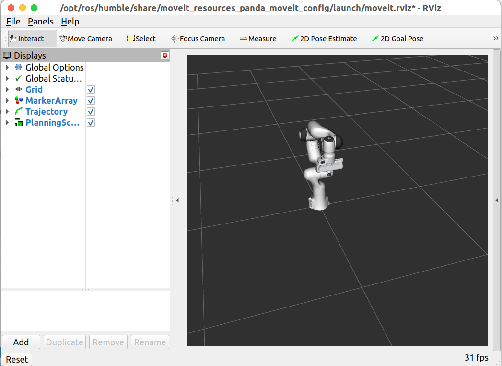

## 2.2.1. 启动演示及配置插件

- 终端输入 `ros2 launch moveit_resources_panda_moveit_config demo.launch.py` 启动机械臂演示：

- `Add` 添加显示类型，一般基础的默认已存在，需要自行添加应用于 `MoveIt` 的主要是 `MotionPlanning`、`TF`、`Axes`

## 2.2.2. 显示类型

- **MotionPlanning** 是 MoveIt 的专用 RViz 插件（Display Type），提供最完整的交互式运动规划界面。 主要功能包括：

  - 可视化并编辑 **Planning Scene**（规划场景，包括机器人当前状态、附加物体、碰撞物体、已知物体等）。
  - 交互设置 **Start State**（起始位姿，通常默认为当前机器人状态）和 **Goal State**（目标位姿，可通过拖拽末端执行器或设置关节角度交互修改）。
  - 选择规划组（Planning Group）、规划器（Planner）、规划参数，并一键 **Plan**（生成轨迹）。
  - 显示生成的 **Planned Path**（规划路径，通常以橙色/绿色线条或动画显示）。
  - 支持 **Execute**（执行规划路径到真实机器人或仿真）。
  - 包含多个子选项卡：Context（上下文配置）、Planning（规划设置）、Scene Objects（场景物体管理）、Query（查询起始/目标状态）、Status（规划状态反馈）。
  - 典型配置：Robot Description → "robot_description"；Trajectory Topic → "/move_group/display_planned_path" 或 "/display_planned_path"；Planning Scene Topic → "monitored_planning_scene" 或 "planning_scene"。 → 这是 MoveIt 用户最核心的插件，几乎所有交互式规划调试都依赖它。
- **TF** 显示整个 TF（变换树）坐标系关系。 主要功能：

  - 以坐标轴形式可视化所有广播的坐标系（frame）及其父子关系（树状结构）。
  - 帮助快速检查坐标变换是否正确，例如 base_link → tool0 → wrist → end_effector 等链路。
  - 在 MoveIt 中非常重要：用于验证末端位姿、规划帧是否对齐、是否存在 TF 断链或延迟问题。 → 推荐始终添加，并启用 "Show Names" 和 "Show Axes" 以便观察。
- **Axes** 显示一组固定的三维坐标轴（X 红、Y 绿、Z 蓝）。 主要功能：

  - 作为参考坐标系，帮助判断当前 Fixed Frame 的方向和原点位置。
  - 在 MoveIt 调试中常用于确认规划帧（通常设为 /base_link 或 /world）的朝向是否正确。 → 简单但实用，常与 TF 一起使用作为全局参考。
- **PlanningScene**（或 Scene Robot / Planning Scene Robot） 这是 **MotionPlanning** 插件内部的子显示选项（在 MotionPlanning 的 Displays 属性中展开）。 主要功能：

  - 显示当前规划场景中的机器人模型（Scene Robot）。
  - 可单独开关：Show Robot Visual（可视几何体）、Show Robot Collision（碰撞体，通常半透明）、Octree / Attached / World Objects（附加物体、世界物体）。 → 用于检查场景是否正确更新、碰撞检测是否生效。
- **Trajectory**（或 Planned Path） 也是 **MotionPlanning** 插件内部的子显示选项（Planned Path 部分）。 主要功能：

  - 显示规划出的轨迹（通常为一系列关节插值点，以线条、动画或轨迹尾迹形式渲染）。
  - 支持 Loop Animation（循环播放轨迹）、Fade Animation（渐隐效果）、轨迹颜色/粗细调整。
  - 可通过 Trajectory Slider（Panel → Motion Planning → Trajectory Slider）手动拖动预览轨迹的每一步。 → 规划成功后，这是最直观的轨迹可视化结果。
