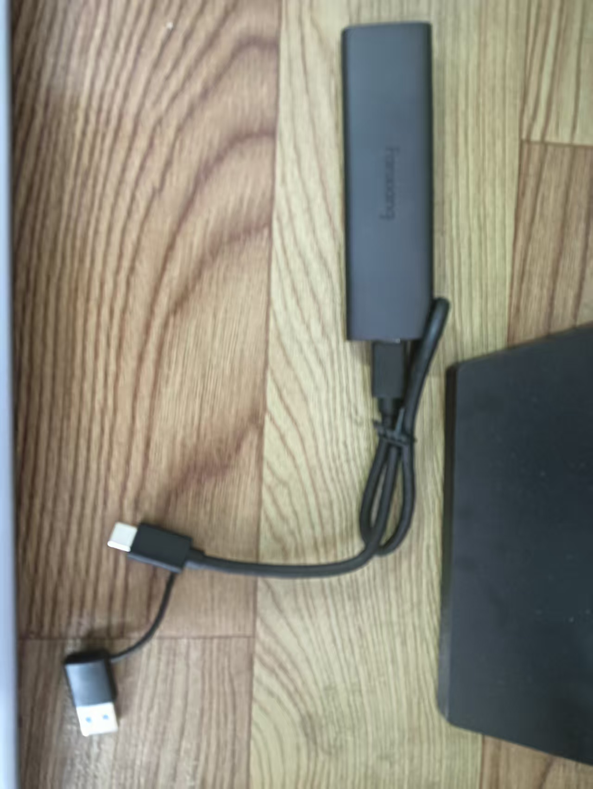
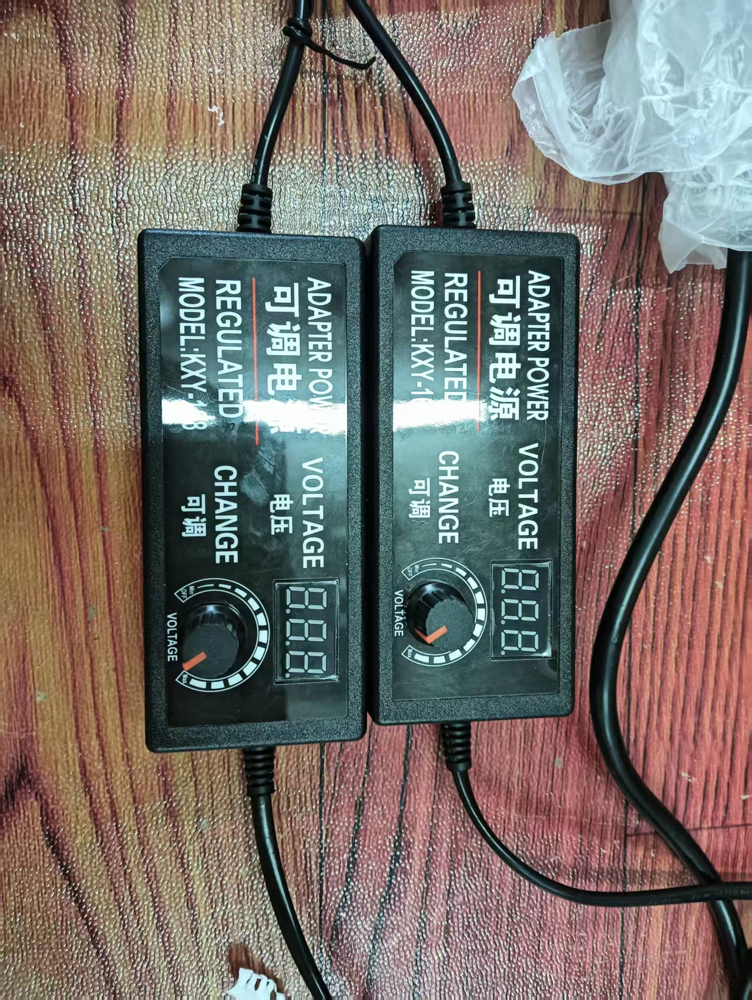
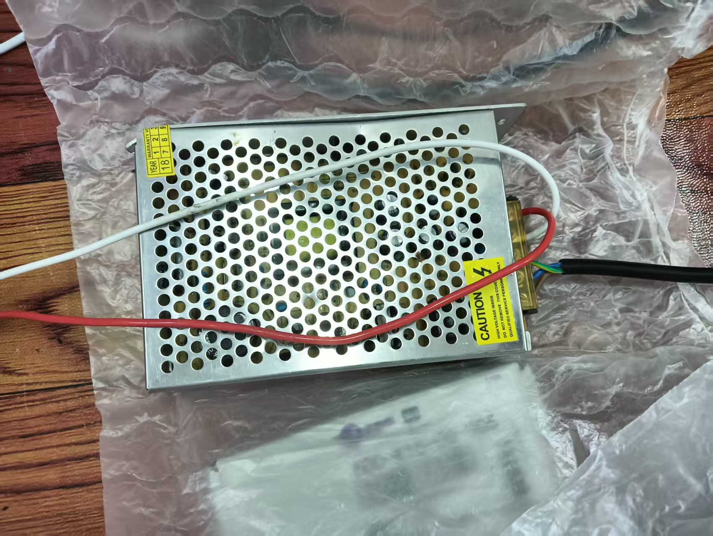
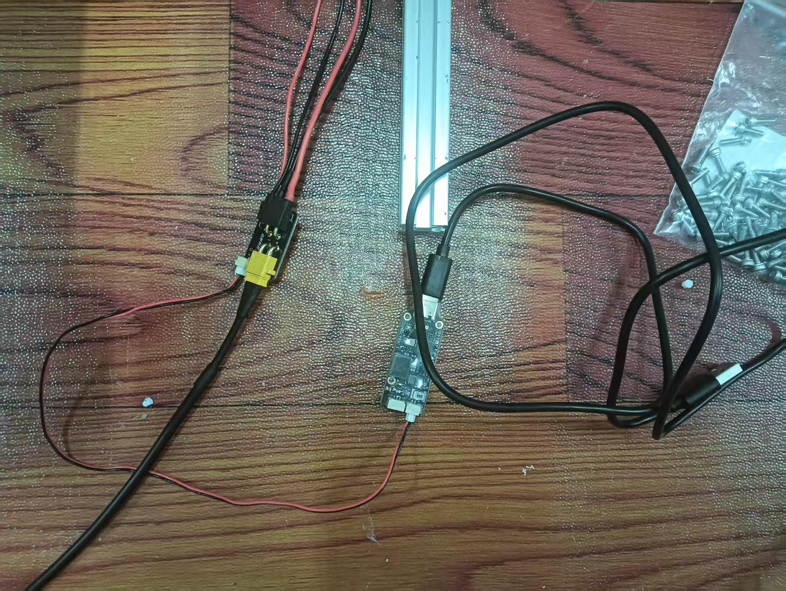
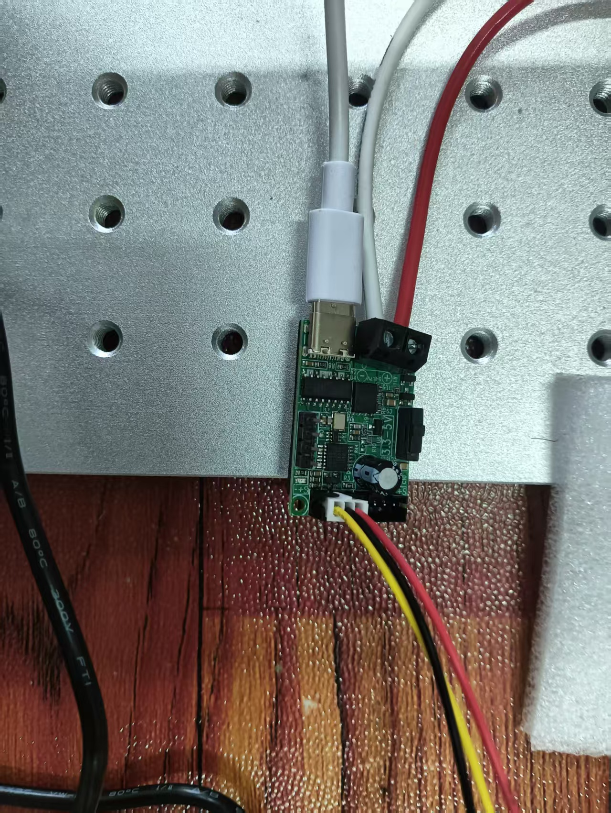
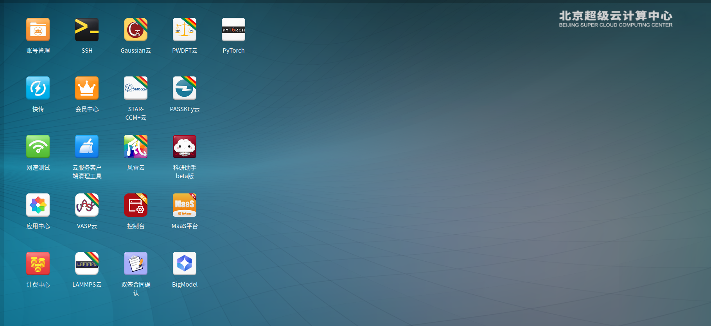
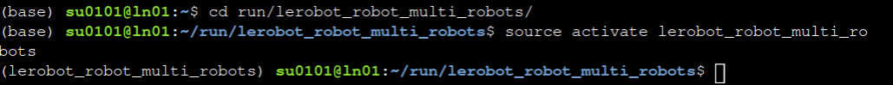
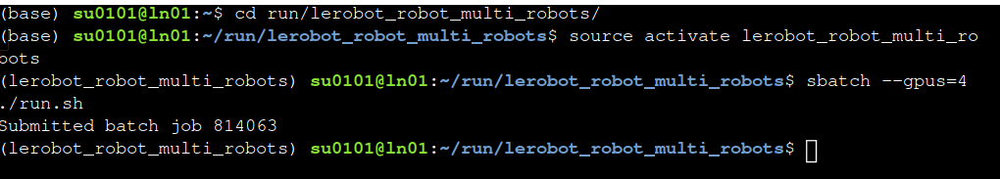
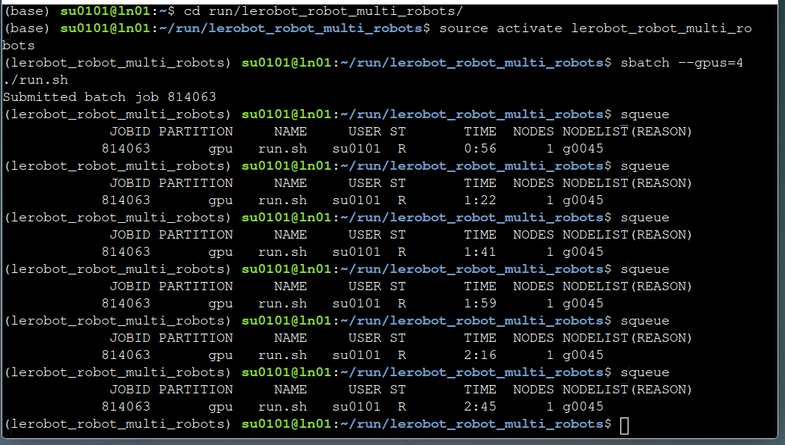
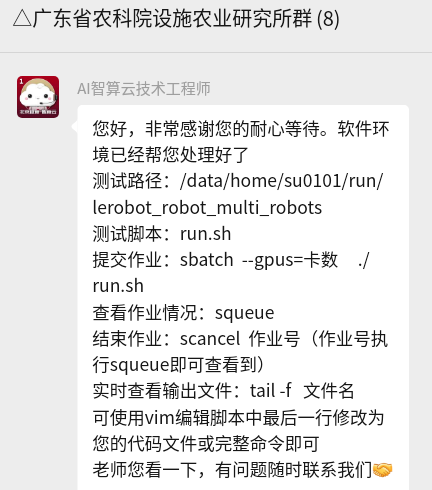

[TOC]

# 达妙机械臂 - LeRobot 使用教程

## 1. 安装与环境准备

### 1.1. 环境配置

确保系统有以下软件：

- v4l2-ctl（用于获取摄像头端口）
- USB 权限（用于机械臂串口设备）
- OpenCV

USB 权限建加 udev 规则：

```bash
sudo usermod -aG dialout $USER
sudo reboot                # 重启
```

### 1.2. 硬件连接

- 移动硬盘：插入移动硬盘
- 电源：小电源开 24V 供从臂；开关电源输出 5V 供主臂

  
- 从臂：小电源接转接板连接到底座供电，CAN 口接 USB 转 CAN 模块 再接电脑，一般是 `/dev/ttyACM*`

    
- 主臂：转接板由开关电源供电，输出 5V 和信号，Type-C 口接电脑，一般是 `/dev/ttyUSB*`

    
- 相机：录包时必须接相机，相机 USB 直接连接，然后用下面的脚本识别

## 2. 识别设备串口并进入虚拟环境

### 2.1. 启用移动硬盘的 conda 环境

插入移动硬盘后在 `/media/$USER/AgroTech/home` 里打开终端输入命令进入虚拟环境 `lerobot` ：

```bash
. ./activate.sh lerobot
```

### 2.2. 确认设备端口

对于机械臂端口，在创建固定端口符号链接之前，可以用 `ls -l /dev/ttyACM*` 和 `ls -l /dev/ttyUSB*` 来确认；对于相机端口，进入工作区 `/media/$USER/AgroTech/home/LeRobot-Workspace/custom-hw-sim` 有脚本 `scripts/get_uvc_cam_idx.py` 可用于查询相机端口、索引、分辨率和帧率信息

### 2.3. 创建固定端口符号链接（可选）

为了避免每次连接设备后端口变化，可以使用脚本 `bash/usb-port-create.sh` 来创建固定的符号链接(即每个实际的 USB 口分配相应的端口名称，如果连接了扩展 USB 则会可延伸)：

```bash
sudo ./bash/usb-port-create.sh
```

注意脚本必须用 `sudo` ，并且只需运行一次，之后每次连接设备后端口变化时，符号链接会自动指向正确的设备，终端输入 `ls -l /dev/com-*` 查询当前已连接设备的固定端口物理地址映射名称及其实际映射的设备：

```bash
示例输出：
    /dev/com-3-video -> video0                                        // 第三个 USB 口连接了 video
    /dev/com-1.4-tty -> ttyACM0                                        // 第一个 USB 口连接着扩展坞，扩展坞第四个口连接了 TTY
    /dev/com-2.1-tty -> ttyUSB0                                        // 第二个 USB 口连接着扩展坞，扩展坞第一个口连接了 TTY
```

`udev` 规则文件位于 `/etc/udev/rules.d/90-usb-by-port.rules` ，只会新增固定地址的端口，不会影响原来的正常使用，如果后续需要删除则终端输入 `sudo rm -f /etc/udev/rules.d/90-usb-by-port.rules`

## 3. 主从遥操作（teleop.py）

### 3.1. 单臂遥操作

在虚拟环境中进入终端输入 `python scripts/teleop.py` ，具体参数配置见脚本注释，按实际修改

### 3.2. 脚本

在仓库 `/media/$USER/AgroTech/home/LeRobot-Workspace/custom-hw-sim` 的 `scripts` 中有方便使用的脚本：

<table>
<tr>
<td>脚本路径<br/></td><td>作用<br/></td><td>注意事项<br/></td></tr>
<tr>
<td>`scripts/follower_test.py`<br/></td><td>读取从臂关节角度，确保有连接上从臂<br/></td><td>端口要对应上<br/></td></tr>
<tr>
<td>`scripts/leader_test.py`<br/></td><td>读取主臂关节角度，确保有连接上主臂<br/></td><td>端口要对应上<br/></td></tr>
<tr>
<td>`scripts/teleop.py`<br/></td><td>启动单臂遥操作<br/></td><td>端口要对应上，可选参数 `--display_data` 启动 LeRobot GUI<br/></td></tr>
<tr>
<td>`scripts/calibration_follower.py`<br/></td><td>将从臂当前所有角度设为零点<br/></td><td>注意不稳定的时候别重设零点<br/></td></tr>
<tr>
<td>`scripts/calibration_leader.py`<br/></td><td>将主臂当前所有角度设为零点<br/></td><td>注意不稳定的时候别重设零点<br/></td></tr>
<tr>
<td>`scripts/dual_teleop.py`<br/></td><td>启动双臂遥操作<br/></td><td>端口要对应上<br/></td></tr>
<tr>
<td>`scripts/reset.py`<br/></td><td>机械臂复位<br/></td><td><br/></td></tr>
<tr>
<td>`scripts/process_data.py`<br/></td><td>对训练集进行平滑+线性插值<br/></td><td><br/></td></tr>
<tr>
<td>`scripts/process_meta.py`<br/></td><td>更新训练集统计信息<br/></td><td><br/></td></tr>
<tr>
<td>`scripts/infer_dm.py`<br/></td><td>纯推理脚本<br/></td><td><br/></td></tr>
</table>

## 4. 数据采集（record_dm.sh）

### 4.1. 登录 Hugging Face 及修改训练集存储位置

训练集需要上传到 Hugging Face Hub 上进行模型训练，现在 [Hugging Face](https://huggingface.co/) 上登录并在 `Setting/Access Tokens` 中新建一个 Token，将 Token 复制下来后在虚拟环境中输入命令 `hf auth login` 根据弹出来的提示依次输入 Token 和 Y (Add token as git credential)

> 在登录前先配置 Git 的 credential helpr : `git config --global credential.helper store`
> 并且注意登录时梯子要挂全局模式（ 服务模式 + Tun 模式）让终端能翻墙登录后

登录后用 `ht auth whoami` 来确认有没有登录成功，同时 Token 也会被保存在 `~./cache/huggingface/stored_tokens` 中

训练集默认是存储在 `~./cache/huggingface/lerobot/<repo_id>/` 中，为了避免空间爆炸，需要在 `.bashrc` 里添加 `export HF_HOME="路径"` （这个指令将 `huggingface/` 搬到指定的位置），例如搬到移动硬盘里，那路径就是 `"/media/.../.../huggingface"` ，如果使用当前移动硬盘版本，则务必做好这一步

### 4.2. 扫描并加入摄像头

- 使用脚本 `scripts/get_uvc_cam_idx.py` 获取可用相机的索引和可用分辨率及对应帧数，一般使用直接 `python scripts/get_uvc_cam_idx.py` 即可，其他参数及具体使用方法见脚本
- 注意使用该脚本前需要自行安装 `v4l-utils` ：

  ```bash

    sudo apt install v4l-utils
    ```
	

- 获取索引后配置 `scripts/record_dm.sh` 的相机参数 `CAMERAS_CONFIG` ，修改相机索引
	

- 相机可随意摆放，唯一要求是相机能观测到机械臂本体的完整动作（如果动作涉及交互物，则交互动作不能被遮挡），并且摆放好之后尽量别挪动位置
	

- 固定摄像头的索引：[Linux 下将摄像头绑定到固定 /dev/video 设备路径的详细指南](https://geek-blogs.com/blog/linux-bind-camera-to-fixed-dev-video/)（固定串口操作同理），后续会写一个自动配置端口的脚本来方便使用
	

### 4.3. 训练集录包


- 在运行命令行或脚本后的录包操作：
	
	- 语音播报内容：
		- 开始录制第 X 个 episode：`"录制第 X 集"`
		- 重置环境阶段：`"复位环境"`
			
	- 键盘操作：
		- 右箭头键 `→` ：结束当前 episode 并推进到下一个
			- 左箭头键 `←` ：重新录制当前 episode
			- `ESC` 键：结束整个录制过程并根据 `push_to_hub` 参数来保存本地 + 上传 Hub
				
				

- 录包脚本 `bash/record-dm.sh` 和双臂录包脚本 `bash/dual-record-dm.sh` ：
	
	- 进入虚拟环境后先给脚本权限：`chmod +x bash/record-dm.sh`
	- 在终端输入 `./bash/record-dm.sh` 来启动录包脚本
	- 参数 `--repo_id` 必填，为训练集名称；默认开启续录，当训练集不存在时自动创建
	- 常规使用：`./bash/record-dm.sh --repo_id $USER/name`
	- 目前脚本默认是：`Recording ...` 花了多长时间，则 `Reset ...` 则需要花同等时间
	- 具体参数见脚本注释，主要要按格式填好摄像头配置，然后重置时间 `Reset the environment` 这个注意是重复 `episode` 使用的时间，例如预设的是30s，而实际提前录制完成使用的时间为15s，那 `RESET_TIME_S` 如果设置为10s，那就会再播报 `Reset the environment` 之后会有10s时间来继续遥操作，10s后停止遥操作并给 15s + 10s = 25s 的时间来重置环境；因此 `RESET_TIME_S` 建议设置为0，录制期间就完成动作并复位好机械臂然后按下 `→` 按键进行环境复原，效率会更高

- 录包期间操作：
	- 听语音播报：`录制第 X 集` 时开始动作（其中 X 表示为在录第 X 个 episode）
	- 听语音播报：`复位环境` 时恢复场景
	- `←` 按键：重新录制当前 episode
	- `→` 按键：提前录制完成当前 episode ，可以开始场景恢复以准备下一个 episode
	- `ESC` 按键：终止录制，终止后小机械臂可以随便动，达妙机械臂会保持力矩在原位姿

- 终止录制后，终端输入 `python scripts/reset.py` 来让达妙机械臂复位并失能
	

### 4.4. 录包技巧


- 按 LeRobot 官方的推荐，应该 10 个 episodes 为一组，录制多个随机分布的场景，至少有五个场景也就是至少有 50 个 episodes 作为一次最简训练集，同时最佳实践是操作者能仅通过摄像头来完成全部操作，同时操作完整、平滑不突变，并在录包完成后对数据进行 线性插值 + 平滑滤波处理：
	
	```
Tips for gathering data

Once you’re comfortable with data recording, you can create a larger dataset for training. A good starting task is grasping an object at different locations and placing it in a bin. We suggest recording at least 50 episodes, with 10 episodes per location. Keep the cameras fixed and maintain consistent grasping behavior throughout the recordings. Also make sure the object you are manipulating is visible on the camera’s. A good rule of thumb is you should be able to do the task yourself by only looking at the camera images.

In the following sections, you’ll train your neural network. After achieving reliable grasping performance, you can start introducing more variations during data collection, such as additional grasp locations, different grasping techniques, and altering camera positions.

Avoid adding too much variation too quickly, as it may hinder your results.
```

- 对于相机的摆布，建议是 一个全局视角相机 + 一个末端视角相机
- 更多社区经验见：[LeRobot Community Datasets: what-makes-a-good-dataset](https://huggingface.co/blog/lerobot-datasets#what-makes-a-good-dataset)

### 4.5. 数据处理

找到自己的训练集所在位置，复制 `<repo_id>/data/chunk-xxx/file-xxx.parquet` 到仓库的 `./dataset/data` 中，终端输入 `./scripts/process_data.py` 具体参数配置见脚本注释，查看处理前后的波形，直到突变点极少、波形平滑后再保存，然后把 `stats.json` 放到 `./dataset/meta/` 更新下统计信息下，然后将输出的 `file-xxx_new.parquet` 重命名并覆盖训练集的数据

### 4.6. 官方命令行入口点

代码具体位置：`/AgroTech/home/micromamba/envs/lerobot/lib/python3.10/site-packages/lerobot/scripts`

<table>
<tr>
<td>**命令行入口点**<br/></td><td>**主要作用**<br/></td></tr>
<tr>
<td>lerobot-calibrate<br/></td><td>用于校准机器人组件（如关节、电机），支持多种硬件（如 OMX）<br/></td></tr>
<tr>
<td>lerobot-dataset-viz<br/></td><td>可视化机器人数据集，包括轨迹、图像和动作序列，支持 rerun.io 或 HTML 输出<br/></td></tr>
<tr>
<td>lerobot-edit-dataset<br/></td><td>编辑和转换数据集，例如将图像序列转换为视频格式或清洗数据（仅裁剪）<br/></td></tr>
<tr>
<td>lerobot-eval<br/></td><td>评估训练好的策略模型，支持模拟环境和真实硬件，计算成功率等指标<br/></td></tr>
<tr>
<td>lerobot-find-cameras<br/></td><td>检测和识别连接的摄像头设备，支持预热和配置测试<br/></td></tr>
<tr>
<td>lerobot-find-joint-limits<br/></td><td>确定机器人的关节极限范围，支持多种机器人类型<br/></td></tr>
<tr>
<td>lerobot-find-port<br/></td><td>查找机器人通信的串口（如 /dev/ttyACM*）<br/></td></tr>
<tr>
<td>lerobot-imgtransform-viz<br/></td><td>可视化图像变换（如裁剪、归一化）效果，用于数据预处理调试<br/></td></tr>
<tr>
<td>lerobot-info<br/></td><td>显示机器人设置和配置的详细信息，用于诊断和验证<br/></td></tr>
<tr>
<td>lerobot-record<br/></td><td>录制机器人交互数据（遥操作或策略 rollout），并生成数据集，支持上传 Hugging Face Hub<br/></td></tr>
<tr>
<td>lerobot-replay<br/></td><td>重放录制的机器人数据，用于验证或演示轨迹<br/></td></tr>
<tr>
<td>lerobot-setup-motors<br/></td><td>配置机器人电机（如 ID、波特率），支持多种硬件<br/></td></tr>
<tr>
<td>lerobot-teleoperate<br/></td><td>实时遥操作机器人，用于数据采集，支持键盘或 leader-follower 模式<br/></td></tr>
<tr>
<td>lerobot-train<br/></td><td>训练机器人策略模型（如 ACT、Diffusion），支持从数据集加载和 WandB 监控<br/></td></tr>
</table>

## 5. 模型训练（train_dm.sh）

### 5.1. 本机本地训练

1. 录制好训练集后即可开始训练，运行脚本：

   ```bash

    ./bash/train_dm.sh --policy_repo_id 模型名称 --dataset_repo_id 训练集名称
    ```
	

2. 训练启动后会进入后台进行训练，训练进度在 `./log/` 下生成的 `训练集名称.log` 中实时打印，第一次训练会有进度条不停打印在下载前置，正式开始训练时会有以下内容，每200步会打印一次进度：
	
	```bash
INFO 2025-12-23 18:25:19 ot_train.py:347 step:200 smpl:400 ep:1 epch:0.05 loss:0.737 grdn:51.002 lr:1.0e-05 updt_s:0.182 data_s:0.005
INFO 2025-12-23 18:25:55 ot_train.py:347 step:400 smpl:800 ep:2 epch:0.09 loss:0.546 grdn:36.100 lr:1.0e-05 updt_s:0.177 data_s:0.004
INFO 2025-12-23 18:26:32 ot_train.py:347 step:600 smpl:1K ep:3 epch:0.14 loss:0.498 grdn:28.908 lr:1.0e-05 updt_s:0.181 data_s:0.004
INFO 2025-12-23 18:27:07 ot_train.py:347 step:800 smpl:2K ep:4 epch:0.18 loss:0.445 grdn:26.680 lr:1.0e-05 updt_s:0.172 data_s:0.004
INFO 2025-12-23 18:27:43 ot_train.py:347 step:1K smpl:2K ep:5 epch:0.23 loss:0.415 grdn:23.008 lr:1.0e-05 updt_s:0.175 data_s:0.004
```

3. 训练完成后会有以下内容：

   ```bash

    INFO 2025-12-23 20:13:54 ot_train.py:347 step:40K smpl:80K ep:182 epch:9.10 loss:0.092 grdn:6.646 lr:1.0e-05 updt_s:0.160 data_s:0.003
    INFO 2025-12-23 20:13:54 ot_train.py:357 Checkpoint policy after step 40000
    INFO 2025-12-23 20:13:55 ot_train.py:426 End of training

    ```
	

4. 训练好的模型会在当前文件夹的 `output` 文件夹下，如果需要终止训练，则见 `./log/训练集名称.param` 里的训练集PID：`TRAIN_PID=pid` ，在终端中输入 `kill pid` 即可停止终止训练，此时 `output` 文件夹里只会有训练了一半的模型（根据步数，在40000步情况下会有 20000 和 40000 两个步数时的模型）
	
	>   _其他参数需要修改的见脚本注释_
	

### 5.2. 超算平台训练


1. **网址：**[北京超级云计算中心](https://cloud.blsc.cn/)
	- 界面：
	- 主要功能：①快传：用于传文件；②SSH：终端（注意连接后就会开始计费，此外就是提交作业到完成期间会计费）
		

2. **快传：**进入 `/data/home/su0101/run/` ，文件都要放这里，`/data/home/su0101/` 及父目录存不了多少，超过就会另外计费
	- `/data/home/su0101/run/lerobo_robot_multi_robots/` 目录下是双臂的内容
	- `/data/home/su0101/run/lerobo_robot_multi_robots/hub/` 是训练 `VLA` 模型需要的预训练模型
	- `/data/home/su0101/run/lerobo_robot_multi_robots/torch_cache/` 是训练 `ACT` 模型需要的预训练模型
	- `/data/home/su0101/run/lerobo_robot_multi_robots/lerobot/` 是训练集
	- `/data/home/su0101/run/lerobo_robot_multi_robots/models/` 是训练好的模型
	- `/data/home/su0101/run/lerobo_robot_multi_robots/run.sh` 是训练脚本
	- `/data/home/su0101/run/lerobo_robot_multi_robots/datasets/` 是训练期间的缓存，不用管
		

3. **SSH**：连接 `su0101` 超算帐号，先进入指定目录再切环境
	
	- 常用命令：
		- `sbatch --gpus=2 ./run.sh`：用当前目录下的 `run.sh` 脚本，启用两张 4090 GPU 进行模型训练
		- `squeue` ：查看当前作业情况
		- `scancel 作业号` ：取消指定作业
			

4. **IL 模型训练步骤**：
	
	- 无论是训练 `ACT` 还是 `SmolVLA` 模型，都先将训练集放至 `/data/home/su0101/run/lerobo_robot_multi_robots/lerobot/` 目录下，如 `agro/leaf_v0` 训练集的最终路径就是 `/data/home/su0101/run/lerobo_robot_multi_robots/lerobot/agro/leaf_v0`
		
	- 如果是训练 `ACT` 模型，则按实际情况修改 `run.sh` 脚本中的以下内容（修改除了用 `vim` ，也可以下载下来在本地修改再覆盖回去）：
		
		```bash
# 修改相关参数
BASE_ID="agro/leaf_v0"                  # 数据集名称
POLICY_TYPE="act"                                 # 模型类型：act / smolvla/ pi0 / pi05 等
STEPS=40000                                # 总训练步数
# ACT 专用
USE_VAE="true"                          # 是否使用 VAE
N_ACTION_STEPS=10
CHUNK_SIZE=50
```
- 修改完毕在 `SSH` 里进入目录，进入环境后输入 `sbatch --gpus=2 ./run.sh` 即可，日志会打印在当前目录下，正常来讲就跟本地训练一样初始化完毕就会显示当前进度相关信息
	
- 如果是训练 `SmolVLA` 模型，则先打开 `/data/home/su0101/run/lerobot_robot_multi_robots/hub/models--lerobot--smolvla_base/snapshots/main` 目录，按实际情况修改 `config.json` 文件的以下内容：
	
	```json
"input_features": {
"observation.state": {
"type": "STATE",
"shape": [
14                        # 机械臂总关节数，如果是双臂，每臂 6 轴 +1 末端=7，然后 7x2=14
]
},
# 以下三个 VISUAL 就是三个摄像头的信息，包括摄像头名称和参数要对应上训练集
"observation.images.left_cam": {
"type": "VISUAL",
"shape": [
3,                        # 通道数，一般 RGB 就是三通道
480,                # 宽
640                        # 长
]
},
"observation.images.eye_cam": {
"type": "VISUAL",
"shape": [
3,
720,
1280
]
},
"observation.images.right_cam": {
"type": "VISUAL",
"shape": [
3,
480,
1280
]
}
},
"output_features": {
"action": {
"type": "ACTION",
"shape": [
14                        # 机械臂总关节数，如果是双臂，每臂 6 轴 +1 末端=7，然后 7x2=14
]
}
},

```

- 然后同理修改 `run.sh` 脚本，修改完同理新建作业：

  ```bash
# 修改相关参数
BASE_ID="agro/leaf_v0"                  # 数据集名称
POLICY_TYPE="smolvla"                   # 模型类型：act / smolvla / pi0 / pi05 等
STEPS=40000                              # 总训练步数
  ```

- 参考示意图：

  

  

  查看作业是否存活，然后在当前目录打开日志（`.out` 后缀文件），如果看到进度日志就说明开始训练了。

5. **环境配置**：如果是需要用新的虚拟环境训练其他模型，需要自行准备好 `pyprojet.toml` 配置文件，在群里告知工程师需要配置该环境并命名为...，环境创建好后工程师会在群里通知你

   - 
   - 训练脚本也就是 `run.sh` ，默认是在激活环境后调用你的实际训练脚本：`python xxx.py` ，按实际情况修改，也可以直接在 `run.sh` 里进行配置，以双臂 `IL+RL` 为例：

     ```bash
#!/bin/bash

# 北京超级云计算中心平台训练 run.sh

# 提交作业：sbatch --gpus=卡数 ./run.sh

# 查看作业情况：squeue

# 结束作业：scancel 作业号（作业号执行 squeue 即可查看到）

# 实时查看输出文件：tail -f 文件名

module load miniforge3/24.11
source activate lerobot_robot_multi_robots
export PYTHONUNBUFFERED=1

export HF_HUB_OFFLINE=1
export HF_DATASETS_OFFLINE=1
export TORCH_HOME=/data/home/su0101/run/lerobot_robot_multi_robots/torch_cache
export HF_HOME=/data/home/su0101/run/lerobot_robot_multi_robots

# 修改相关参数

BASE_ID="agro/leaf_v0"                  # 数据集名称
POLICY_TYPE="smolvla"                   # 模型类型：act / smolvla/ pi0 / pi05 等
STEPS=40000                                # 总训练步数

# ACT 专用

USE_VAE="true"                          # 是否使用 VAE
N_ACTION_STEPS=10
CHUNK_SIZE=50

# 后续自动变更，此处仅定义

GRAD_ACC_STEPS=4                        # 梯度累积步数
BATCH_SIZE_PER_GPU=8                    # 每张卡的 batch size

# 自动推导路径参数

DATASET_ID="${BASE_ID}"
POLICY_ID="${BASE_ID}_${POLICY_TYPE}"
DATASET_ROOT="/data/home/su0101/run/lerobot_robot_multi_robots/lerobot/${BASE_ID}"
OUTPUT_DIR="/data/home/su0101/run/lerobot_robot_multi_robots/models/${BASE_ID}_${POLICY_TYPE}"
JOB_NAME="${BASE_ID}_${POLICY_TYPE}"

# 动态参数

POLICY_ARGS=""

if [ "$POLICY_TYPE" = "act" ]; then
POLICY_ARGS="--policy.type=${POLICY_TYPE} 
--policy.use_vae=${USE_VAE} 
--policy.n_action_steps=${N_ACTION_STEPS} 
--policy.chunk_size=${CHUNK_SIZE}"
# ACT 建议较大 batch
BATCH_SIZE_PER_GPU=16
GRAD_ACC_STEPS=2

elif [ "$POLICY_TYPE" = "smolvla" ]; then
POLICY_ARGS="--policy.path=/data/home/su0101/run/lerobot_robot_multi_robots/hub/models--lerobot--smolvla_base/snapshots/main"
# VLA 显存需求较高，建议小 batch + 累积
BATCH_SIZE_PER_GPU=8
GRAD_ACC_STEPS=4

# TODO: 具体的预训练模型

elif [ "$POLICY_TYPE" = "pi0" ] || [ "$POLICY_TYPE" = "pi05" ]; then
POLICY_ARGS="--policy.path=/data/home/su0101/run/lerobot_robot_multi_robots/hub/models--lerobot--smolvla_base/snapshots/main"
BATCH_SIZE_PER_GPU=4
GRAD_ACC_STEPS=4

else
echo "错误：不支持的 POLICY_TYPE: ${POLICY_TYPE}"
echo "支持类型：act, smolvla, pi0, pi05"
exit 1
fi

# 多卡训练

accelerate launch 
--multi_gpu 
--mixed_precision=bf16 
--num_processes="${SLURM_GPUS:-1}" 
--num_machines=1 
--dynamo_backend=no 
--gradient_accumulation_steps="${GRAD_ACC_STEPS}" 
-m lerobot.scripts.lerobot_train 
${POLICY_ARGS} 
--batch_size="${BATCH_SIZE_PER_GPU}" 
--steps="${STEPS}" 
--dataset.repo_id="${DATASET_ID}" 
--dataset.root="${DATASET_ROOT}" 
--dataset.video_backend="pyav" 
--policy.repo_id="${POLICY_ID}" 
--policy.push_to_hub="false" 
--policy.device="cuda" 
--output_dir="${OUTPUT_DIR}" 
--job_name="${JOB_NAME}" \

```
		

## 6. 模型评估与纯推理脚本（eval_dm.sh 和 infer_dm.py）


### 6.1. 模型评估


        训练好的模型可以运行脚本来评估：


```bash
./bash/eval_dm.sh --policy_repo_id 模型名称
```

注意该评估脚本只能直接运行训练脚本训练出来的模型；如果想运行其他脚本，先上传到 Hub，然后输入：

```bash
# ./eval_dm.sh --policy_repo_id 模型名称 --from_hub
```

评估也相当于一次录制，录制的结果会和训练集存在一起并加上前缀 `eval_`。

### 6.2. 纯推理脚本

`scripts/infer_dm.py` 是纯推理脚本，可自定义输出动作处理，加了安全检测、自动平滑归零和多线程采集推理；具体信息参照脚本说明，后续方便改成 `ROS-PY` 节点方便和其他系统对接。

#### 6.2.1. 使用步骤

- 无论是 `ACT` 还是 `SmolVLA` 模型，都要先把 `output/` 放在工作区且终端在工作区执行脚本 `python ./scripts/infer_dm.py` ，模型目录具体结构参考脚本说明
- 如果是 `ACT` 模型则直接按情况填好配置区后执行
- 如果是 `SmolVLA` 模型则需要先配置预训练模型，首先将预训练模型 `models--HuggingFaceTB--SmolVLM2-500M-Video-Instruct` 下载到任意位置，该预训练模型下载路径：[SmolVLM2-500M-Video-Instruct](https://huggingface.co/HuggingFaceTB/SmolVLM2-500M-Video-Instruct/tree/main)，下载好后修改 `SmolVLA` 模型的配置，如 `./outputs/dual_arm_box_smolvla/checkpoints/last/pretrained_model` 下的 `config.json` 和 `policy_preprocessor.json` 两个配置文件需要修改以下内容：

    在 `config.json` 中找到 `vlm_model_name`，改为本地路径：

    ```json
    "vlm_model_name": "/media/kaede-rei/AgroTech/home/huggingface/hub/models--HuggingFaceTB--SmolVLM2-500M-Video-Instruct"
    ```

    在 `policy_preprocessor.json` 中找到 `tokenizer_name`，改为本地路径：

    ```json
    "tokenizer_name": "/media/kaede-rei/AgroTech/home/huggingface/hub/models--HuggingFaceTB--SmolVLM2-500M-Video-Instruct"
    ```

#### 6.2.2. 常用参数

- `--dual_arm`：双臂模式
- `--model_type`：模型类型，`act` 或 `smolvla`
- `--task`：SmolVLA 任务描述（自然语言）
- `--model_path`：模型路径
- `--port`：单臂串口路径
- `--left_port`：双臂左臂串口
- `--right_port`：双臂右臂串口
- `--device`：`cuda` 或 `cpu`
- `--freq`：控制频率 Hz（建议 30）
- `--use_amp`：混合精度推理
- `--joint_velocity_scaling`：关节速度缩放（0-1）
- `--filter_tau`：低通滤波时间常数（秒，越大越平滑）
- `--no_filter`：禁用滤波（不推荐）
- `--use_async_obs`：异步观测采集
- `--obs_freq`：观测采集频率 Hz
- `--always_action`：即使违规也始终执行动作（不推荐，谨慎使用）
- `--max_velocity`：最大关节速度（rad/s）
- `--max_change`：单步最大变化（rad）
- `--reset_time`：归零时间（秒）
- `--no_reset`：退出不归零（危险）
- `--compile`：使用 torch.compile

#### 6.2.3. 运行提示

- 真机测试前先降低 `joint_velocity_scaling`（建议 0.05-0.1）
- 不要在高负载 CPU 下运行高频控制，避免丢帧与卡顿
- 建议开启滤波，否则模型输出可能抖动
- 退出时请保持机械臂工作空间安全，避免碰撞

## 7. 双臂操作（dual_teleop.py 和 dual-record-dm.sh）

1. **主从遥操作**：

   类似单臂的脚本，双臂多加一对机械臂的端口，然后终端输入 `python ./scripts/dual_teleop.py`
2. **双臂录包**：

   类似单臂的脚本，双臂多加一对机械臂的端口，然后终端输入 `./bash/dual-record-dm.sh --repo_id {repo_name}`

## 8. 自定义硬件

LeRobot 采用插件化架构，可以通过继承 Robot 基类并注册的方式添加自定义插件支持

### 8.1. 核心步骤

1. **自定义硬件代码结构**：

    ```text
    custom-hw-sim/
    ├── lerobot_robot_multi_robots/（自定义硬件包）
    │   ├── motors/（放电机驱动库）
    │   ├── __init__.py（导入自定义硬件）
    │   ├── config_{name}.py（自定义硬件配置）
    │   └── {name}.py（自定义硬件驱动）
    └── pyproject.toml（工作区配置文件）
    ```
	

2. **实现底层通信驱动( ****lerobot_robot_multi_robots/motors/**** )**：实现底层通信驱动类用于对接自定义硬件接口
	
	                在**实现类**中集成实际的硬件通信代码可以直接使用 `serial`、`socket`、`pyserial` 等标准库，或引入第三方驱动（如 CAN 协议库、Dynamixel SDK、Feetech SDK 等）
	

3. **定义配置类( ****lerobot_robot_multi_robots/config_{name}.py**** )**：继承 `RobotConfig` 并注册名称
	
	- 创建一个继承自 `lerobot.robots.RobotConfig` 的数据类，使用 `@RobotConfig.register_subclass("{name}")` 装饰器进行注册
	- 该类用于存放硬件特定参数（如端口、波特率、相机配置等）
		

4. **定义实现类( ****lerobot_robot_multi_robots/{name}.py**** )**：继承 `Robot` 并实现核心接口
	
	                创建一个继承自` lerobot.robots.Robot` 的类，指定 `config_class` 为上一步定义的配置类；
	
	                必须实现以下关键属性和方法：
	
	- `observation_features` 和 `action_features`：定义观察和动作的空间结构
	- `connect()`、`disconnect()`：建立和断开硬件通信
	- `get_observation()`：读取传感器状态和图像
	- `send_action()`：向硬件发送控制指令
	- 可选实现 `calibrate()`、`configure()` 等
		

5. **导出自定义硬件( ****lerobot_robot_multi_robots/__init__.py**** )**：在包里统一导出自定义硬件各类
	

6. **安装自定义硬件( ****pyproject.toml**** )**：配置好工作区环境，将自定义硬件安装进工作区里

### 8.2. 代码示例


以 达妙机械臂 - LeRobot - TRLC - dm 的主臂为例，目前就是利用自定义硬件接口实现整机移动到新版 LeRobot 方便在移动硬盘使用和进行强化学习训练


- `lerobot_robot_multi_robots/config_dm_arm.py` ：
	

```python
from dataclasses import dataclass, field

from lerobot.robots import RobotConfig
from lerobot.teleoperators import TeleoperatorConfig
from lerobot.cameras import CameraConfig

@RobotConfig.register_subclass("dm_follower")
@dataclass
class DMFollowerConfig(RobotConfig):
    port: str
    disable_torque_on_disconnect: bool = True
    joint_velocity_scaling: float = 0.2
    max_gripper_torque: float = 1.0
    cameras: dict[str, CameraConfig] = field(default_factory=dict)

@TeleoperatorConfig.register_subclass("dm_leader")
@dataclass
class DMLeaderConfig(TeleoperatorConfig):
    port: str
    gripper_open_pos: int = 2280
    gripper_closed_pos: int = 1670
```

- `lerobot_robot_multi_robots/dm_arm.py` ：

```python
from .config_dm_arm import DMFollowerConfig, DMLeaderConfig

from functools import cached_property
from typing import Any
import logging
import serial
import time

from lerobot.robots import Robot
from lerobot.teleoperators import Teleoperator
from lerobot.cameras.utils import make_cameras_from_configs
from lerobot.utils.errors import DeviceAlreadyConnectedError, DeviceNotConnectedError
from lerobot.motors.dynamixel import DynamixelMotorsBus, OperatingMode
from lerobot.motors import Motor, MotorNormMode

from lerobot_robot_multi_robots.motors.DM_Control_Python.DM_CAN import *

logger = logging.getLogger(__name__)

def map_range(x: float, in_min: float, in_max: float, out_min: float, out_max: float) -> float:
    return (x - in_min) * (out_max - out_min) / (in_max - in_min) + out_min

class DMFollower(Robot):
    """
    TRLC-DK1 Follower Arm designed by The Robot Learning Company.
    """

    config_class = DMFollowerConfig
    name = "dm_follower"

    def __init__(self, config: DMFollowerConfig):
        super().__init__(config)
        
        # Constants for EMIT control
        self.DM4310_TORQUE_CONSTANT = 0.945  # Nm/A
        self.EMIT_VELOCITY_SCALE = 100  # rad/s
        self.EMIT_CURRENT_SCALE = 1000  # A
        
        self.JOINT_LIMITS = {
            "joint_4": (-100/180*np.pi, 100/180*np.pi),
            "joint_5": (-90/180*np.pi, 90/180*np.pi),
        }
        
        self.DM4310_SPEED = 200/60*2*np.pi   # rad/s (200  rpm | 20.94 rad/s)
        self.DM4340_SPEED = 52.5/60*2*np.pi  # rad/s (52.5 rpm | 5.49  rad/s)

        self.config = config
        self.motors = {
            "joint_1": DM_Motor(DM_Motor_Type.DM4340, 0x01, 0x11),
            "joint_2": DM_Motor(DM_Motor_Type.DM4340, 0x02, 0x12),
            "joint_3": DM_Motor(DM_Motor_Type.DM4340, 0x03, 0x13),
            "joint_4": DM_Motor(DM_Motor_Type.DM4310, 0x04, 0x14),
            "joint_5": DM_Motor(DM_Motor_Type.DM4310, 0x05, 0x15),
            "joint_6": DM_Motor(DM_Motor_Type.DM4310, 0x06, 0x16),
            "gripper": DM_Motor(DM_Motor_Type.DM4310, 0x07, 0x17),
        }
        self.control = None
        self.serial_device = None
        self.bus_connected = False

        self.gripper_open_pos = 0.0
        self.gripper_closed_pos = -4.7

        self.cameras = make_cameras_from_configs(config.cameras)

    @property
    def _motors_ft(self) -> dict[str, type]:
        return {f"{motor}.pos": float for motor in self.motors}

    @property
    def _cameras_ft(self) -> dict[str, tuple]:
        return {
            cam: (self.config.cameras[cam].height, self.config.cameras[cam].width, 3) for cam in self.cameras
        }

    @cached_property
    def observation_features(self) -> dict[str, type | tuple]:
        return {**self._motors_ft, **self._cameras_ft}

    @cached_property
    def action_features(self) -> dict[str, type]:
        return self._motors_ft

    @property
    def is_connected(self) -> bool:
        return self.bus_connected and all(cam.is_connected for cam in self.cameras.values())

    def connect(self) -> None:
        if self.is_connected:
            raise DeviceAlreadyConnectedError(f"{self} already connected")

        self.serial_device = serial.Serial(
            self.config.port, 921600, timeout=0.5)
        time.sleep(0.5)

        self.control = MotorControl(self.serial_device)
        self.bus_connected = True
        self.configure()

        for cam in self.cameras.values():
            cam.connect()

    @property
    def is_calibrated(self) -> bool:
        return True

    def calibrate(self) -> None:
        pass

    def configure(self) -> None:

        for key, motor in self.motors.items():
            self.control.addMotor(motor)

            for _ in range(3):
                self.control.refresh_motor_status(motor)
                time.sleep(0.01)

            if self.control.read_motor_param(motor, DM_variable.CTRL_MODE) is not None:
                print(f"  {key} ({motor.MotorType.name}) is connected.")

                self.control.switchControlMode(motor, Control_Type.POS_VEL)
                self.control.enable(motor)
            else:
                raise Exception(
                    f"Unable to read from {key} ({motor.MotorType.name}).")

        for joint in ["joint_1", "joint_2", "joint_3"]:
            self.control.change_motor_param(self.motors[joint], DM_variable.ACC, 10.0)
            self.control.change_motor_param(self.motors[joint], DM_variable.DEC, -10.0)
            self.control.change_motor_param(self.motors[joint], DM_variable.KP_APR, 200)
            self.control.change_motor_param(self.motors[joint], DM_variable.KI_APR, 10)

        for joint in ["gripper"]:
            self.control.change_motor_param(
                self.motors[joint], DM_variable.KP_APR, 100)

        # Open gripper and set zero position
        self.control.switchControlMode(
            self.motors["gripper"], Control_Type.VEL)
        self.control.control_Vel(self.motors["gripper"], 10.0)
        while True:
            self.control.refresh_motor_status(self.motors["gripper"])
            tau = self.motors["gripper"].getTorque()
            if tau > 1.2:
                self.control.control_Vel(self.motors["gripper"], 0.0)
                self.control.disable(self.motors["gripper"])
                self.control.set_zero_position(self.motors["gripper"])
                time.sleep(0.2)
                self.control.enable(self.motors["gripper"])
                break
            time.sleep(0.01)
        self.control.switchControlMode(
            self.motors["gripper"], Control_Type.Torque_Pos)

    def get_observation(self) -> dict[str, Any]:
        if not self.is_connected:
            raise DeviceNotConnectedError(f"{self} is not connected.")

        # Read arm position
        start = time.perf_counter()

        obs_dict = {}
        for key, motor in self.motors.items():
            self.control.refresh_motor_status(motor)
            if key == "gripper":
                # Normalize gripper position between 1 (closed) and 0 (open)
                obs_dict[f"{key}.pos"] = map_range(
                    motor.getPosition(), self.gripper_open_pos, self.gripper_closed_pos, 0.0, 1.0)
            else:
                obs_dict[f"{key}.pos"] = motor.getPosition()

        dt_ms = (time.perf_counter() - start) * 1e3
        logger.debug(f"{self} read state: {dt_ms:.1f}ms")

        # Capture images from cameras
        for cam_key, cam in self.cameras.items():
            start = time.perf_counter()
            obs_dict[cam_key] = cam.async_read()
            dt_ms = (time.perf_counter() - start) * 1e3
            logger.debug(f"{self} read {cam_key}: {dt_ms:.1f}ms")

        return obs_dict

    def send_action(self, action: dict[str, Any]) -> dict[str, Any]:
        if not self.is_connected:
            raise DeviceNotConnectedError(f"{self} is not connected.")

        goal_pos = {key.removesuffix(
            ".pos"): val for key, val in action.items() if key.endswith(".pos")}

        # Send goal position to the arm
        for key, motor in self.motors.items():
            if key == "gripper":
                self.control.refresh_motor_status(motor)
                gripper_goal_pos_mapped = map_range(goal_pos[key], 0.0, 1.0, self.gripper_open_pos, self.gripper_closed_pos)
                self.control.control_pos_force(motor, gripper_goal_pos_mapped, self.DM4310_SPEED*self.EMIT_VELOCITY_SCALE,
                                               i_des=self.config.max_gripper_torque/self.DM4310_TORQUE_CONSTANT*self.EMIT_CURRENT_SCALE)
            else:
                if key in self.JOINT_LIMITS:
                    goal_pos[key] = np.clip(goal_pos[key], self.JOINT_LIMITS[key][0], self.JOINT_LIMITS[key][1])

                self.control.control_Pos_Vel(
                    motor, goal_pos[key], self.config.joint_velocity_scaling*self.DM4340_SPEED)

        return {f"{motor}.pos": val for motor, val in goal_pos.items()}

    def disconnect(self):
        if not self.is_connected:
            raise DeviceNotConnectedError(f"{self} is not connected.")

        if self.config.disable_torque_on_disconnect:
            for motor in self.motors.values():
                self.control.disable(motor)
        else:
            self.control.serial_.close()
        self.bus_connected = False

        for cam in self.cameras.values():
            cam.disconnect()

        logger.info(f"{self} disconnected.")

class DMLeader(Teleoperator):
    config_class = DMLeaderConfig
    name = "dm_leader"

    def __init__(self, config: DMLeaderConfig):
        super().__init__(config)
        self.config = config
        self.bus = DynamixelMotorsBus(
            port=self.config.port,
            motors={
                "joint_1": Motor(1, "xl330-m288", MotorNormMode.DEGREES),
                "joint_2": Motor(2, "xl330-m288", MotorNormMode.DEGREES),
                "joint_3": Motor(3, "xl330-m288", MotorNormMode.DEGREES),
                "joint_4": Motor(4, "xl330-m288", MotorNormMode.DEGREES),
                "joint_5": Motor(5, "xl330-m077", MotorNormMode.DEGREES),
                "joint_6": Motor(6, "xl330-m077", MotorNormMode.DEGREES),
                "gripper": Motor(7, "xl330-m077", MotorNormMode.DEGREES),
            },
        )

    @property
    def action_features(self) -> dict[str, type]:
        return {f"{motor}.pos": float for motor in self.bus.motors}

    @property
    def feedback_features(self) -> dict[str, type]:
        return {}

    @property
    def is_connected(self) -> bool:
        return self.bus.is_connected

    def connect(self, calibrate: bool = False) -> None:
        if self.is_connected:
            raise DeviceAlreadyConnectedError(f"{self} already connected")

        self.bus.connect(handshake=False)
        self.bus.set_baudrate(1000000)
        
        self.configure()
        
        logger.info(f"{self} connected.")

    @property
    def is_calibrated(self) -> bool:
        return True

    def calibrate(self) -> None:
        pass

    def configure(self) -> None:
        self.bus.disable_torque()
        self.bus.configure_motors()
        
        # Enable torque and set to position to open
        self.bus.write("Torque_Enable", "gripper", 0, normalize=False)
        self.bus.write("Operating_Mode", "gripper", OperatingMode.CURRENT_POSITION.value, normalize=False)
        self.bus.write("Current_Limit", "gripper", 100, normalize=False)
        self.bus.write("Torque_Enable", "gripper", 1, normalize=False)
        self.bus.write("Goal_Position", "gripper", self.config.gripper_open_pos, normalize=False)
        
    def setup_motors(self) -> None:
        for motor in self.bus.motors:
            input(f"Connect the controller board to the '{motor}' motor only and press enter.")
            self.bus.setup_motor(motor)
            print(f"'{motor}' motor id set to {self.bus.motors[motor].id}")

    def get_action(self) -> dict[str, float]:
        if not self.is_connected:
            raise DeviceNotConnectedError(f"{self} is not connected.")

        start = time.perf_counter()
        
        action = self.bus.sync_read(normalize=False, data_name="Present_Position")
        action = {f"{motor}.pos": (val/4096*2*np.pi-np.pi) if motor != "gripper" else val for motor, val in action.items()}
        
        action["joint_2.pos"] = -action["joint_2.pos"]

        # # Normalize gripper position between 1 (closed) and 0 (open)
        gripper_range = self.config.gripper_open_pos - self.config.gripper_closed_pos
        action["gripper.pos"] = 1 - (action["gripper.pos"] - self.config.gripper_closed_pos) / gripper_range
        
        dt_ms = (time.perf_counter() - start) * 1e3
        logger.debug(f"{self} read action: {dt_ms:.1f}ms")
        return action

    def send_feedback(self, feedback: dict[str, float]) -> None:
        # TODO(rcadene, aliberts): Implement force feedback
        raise NotImplementedError

    def disconnect(self) -> None:
        if not self.is_connected:
            raise DeviceNotConnectedError(f"{self} is not connected.")

        self.bus.disconnect()
        logger.info(f"{self} disconnected.")
```

- `lerobot_robot_multi_robots/__init__.py` ：

```python
from .config_dm_arm import DMFollowerConfig, DMLeaderConfig
from .dm_arm import DMFollower, DMLeader
```

- `pyproject.toml` ：

```
[build-system]
requires = ["hatchling"]
build-backend = "hatchling.build"

[project]
name = "lerobot_robot_multi_robots"
version = "0.1.0"
dependencies = [
    "numpy>=2.0.1",
    "pyserial>=3.5",
    "dynamixel-sdk>=3.7.31",
    "lerobot",
    "opencv-python>=4.8.0",
    "matplotlib>=3.7.2",
    "pandas>=2.2.0",
    "scipy>=1.11.1",
]

[tool.hatch.metadata]
allow-direct-references = true
```

### 8.3. 安装并查询是否可用

进入虚拟环境后在终端输入 `pip install -e .` 安装成功后输入 `lerobot-teleoperate --robot.type --teleop.type --help` 来查看是否有安装的自定义硬件的可选参数

```bash
(lerobot) $USER@$USER:/media/$USER/AgroTech/home/LeRobot-Workspace/custom-hw-sim$ lerobot-teleoperate --robot.type --teleop.type --help
# 输出：
usage: lerobot-teleoperate [-h] [--config_path str] [--teleop str] 
[--teleop.type {so100_leader,bi_so100_leader,gamepad,homunculus_glove,homunculus_arm,koch_leader,so101_leader,dm_leader}]                                         # --teleop.type 这里的最后可以看到 dm_leader
# ...
# ...
[--robot.type {so100_follower,bi_so100_follower,hope_jr_hand,hope_jr_arm,koch_follower,so101_follower,sim_robot,dm_follower}]                           # --robot.type 这里的最后可以看到 dm_follower
# ...
# ...
```
