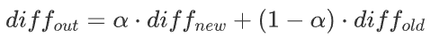

# 3.1.1. PID 算法

熟悉 STM32 可以在网上找点开源的小项目或者参加一些校赛验收下自己学习成果，在这之后就可以考虑进一步的学习，就比赛来讲最先需要学习的是自动控制原理（首先是最常用的 PID 算法，然后是各种类型电机的使用）：

此外，PID 调参由于需要重复测试 + 查看运动波形是否稳定，所以推荐学习调参上位机 Vofa+ 的使用，通过蓝牙模块可以实现非常方便的远程调参，具体可自行了解。

另附调参教程：[PID 调试方法 - 博客园](https://www.cnblogs.com/The-explosion/p/18889148)

1. **基本控制器**
    - PID 类

    ```c
    typedef struct{
    float p;
    float i;
    float d;
    float output;
    float integral;
    float lastErr;
    float intLimit;
    float outputLimit;
    } PID_Param_t;

    ```

	- PID控制器
    
    ```c
    /**
    *@brief PID控制器
    *@param PID 指向PID类实例的指针
    *@param target 目标值
    *@param actual 实际值
    *@param dt_s 控制时间(秒)
    _  */_
    _void PID_Controller(PID_Param_t_     const PID, float target, float actual, float dt_s)
    {
    // 比例项
    float err = target - actual;
    // 微分项
    float diff = (err - PID->lastErr) / dt_s;
    PID->lastErr = err;
    // 积分项
    PID->integral += err * dt_s;
    _constrain(PID->integral, -PID->intLimit, PID->intLimit);
    // PID输出
    PID->output = PID->p * err + PID->i * PID->integral + PID->d * diff;
    _constrain(PID->output, -PID->outputLimit, PID->outputLimit);
    }
    ```

2. **改进理论**
   - 微分项
     1. 微分先行：用被控量的变化率（lastActual - actual）代替误差变化率（err - lastErr）
        - 作用：防止在目标值突变时造成瞬时大冲击
        - 当 target 不变时，两者等价，而 target 突变时，会因为前后 target 不一致导致误差突变
     2. 一阶低通滤波：
        
        - 作用：对微分项进行滤波平滑，减小噪声影响，控制更平稳
        - 缺点：会带来微分响应的延迟
   - 积分项
     1. 抗积分饱和：积分项会随时间不断累积，会导致输出过冲、系统震荡
        - 限幅积分：给输出积分加上下限
        - 条件积分：如果输出已经饱和，则停止积分累积
        - 反计算法：将计算输出与限幅输出相减，整定系数反向积分
     2. 积分分离：当误差特别大时，积分项会迅速累加，导致输出过冲。
        - 规定阈值，当误差小于阈值时才允许积分
        - 缺点：参数选择不当会让系统稳态精度降低
   - 死区
     1. 电机或执行器在误差很小时来回抖动，原因是小误差产生的输出频繁改变方向，噪声导致执行器不停抖
     2. 通过设置死区阈值，当误差在死区范围内时不进行 PID 控制
     3. 缺点：死区过大会有稳态误差
   - 前馈
     1. 预估系统到达目标值所需要的输出值，作为主力输出再将 PID 作为辅助调节叠加在一起
     2. 简单理解就是：大 P/I/D 环(前馈) + 小 PID；前馈由经验得出，PID 作为对实际情况的细致调节
     3. **类型**

# 3.1.3. 卡尔曼融合滤波

## 3.1.3.1. 核心思想

卡尔曼滤波本质上是一个**最优估计器**。它不单纯相信 "理论模型(预测)"，也不单纯相信 "传感器数据(观测)"，而是通过计算两者的**不确定性（协方差）**，加权得出一个最接近真实值的估计

- **核心流程：** 预测 (Predict) \rightarrow 观测更新 (Update) \rightarrow 预测 \rightarrow ...
- **核心机制：** 谁的方差（噪声）小，我就更相信谁

## 3.1.3.2. 场景一：传感器融合

场景： 车辆定位（IMU + GPS）

目标： 利用 IMU 的高频特性和 GPS 的绝对位置，消除 IMU 的漂移并平滑 GPS 的跳变

### 3.1.3.2.1. 矩阵推导

- 状态向量 (x)：$[\text{位置}, \text{速度}]^T$
- $x = [p_x, p_y, v_x, v_y]^T$
- **控制输入 (u)**：来自 IMU 的加速度 $[a_x, a_y]^T$
- **观测向量 (z)**：来自 GPS 的位置 $[z_{px}, z_{py}]^T$
- **状态转移矩阵 (F) & 控制矩阵 (B)**

  基于牛顿运动学公式：

  $$
  p_k = p_{k-1} + v_{k-1}\Delta t + \frac{1}{2}a_{k-1}\Delta t^2
  $$

  $$
  x_{k|k-1} = \underbrace{\begin{bmatrix} 1 & 0 & \Delta t & 0 \\ 0 & 1 & 0 & \Delta t \\ 0 & 0 & 1 & 0 \\ 0 & 0 & 0 & 1 \end{bmatrix}}_{F} x_{k-1} + \underbrace{\begin{bmatrix} \frac{1}{2}\Delta t^2 & 0 \\ 0 & \frac{1}{2}\Delta t^2 \\ \Delta t & 0 \\ 0 & \Delta t \end{bmatrix}}_{B} u_{k-1}
  $$
- **观测矩阵 (H)**

  GPS 只测位置，不测速度，起到“提取”作用：

  $$
  H = \begin{bmatrix} 1 & 0 & 0 & 0 \\ 0 & 1 & 0 & 0 \end{bmatrix}
  $$
- **噪声矩阵设置**

  - Q (过程噪声)：基于 IMU 加速度计的白噪声 $\sigma_a$ 推导
  - R (测量噪声)：基于 GPS 模块的定位精度（如 $3\text{ 米} \Rightarrow \sigma^2=9$）

## 3.1.3.3. 场景二：信号平滑与微分

场景： 机器人模仿学习（AI Policy 输出 \rightarrow 电机执行）

目标： 去除 AI 输出的抖动，并计算出平滑的速度指令

### 3.1.3.3.1. 矩阵推导

- 状态向量 (x)：$[\text{关节角度}, \text{关节角速度}]^T$
- 注意：AI 模型没输出速度，但我们需要隐式推导速度，所以必须包含在状态里。
- **观测向量 (z)**：AI 模型输出的目标角度
- **状态转移矩阵 (F)**

  采用恒定速度模型 (Constant Velocity Model)。假设 $\Delta t=1$（以一步推理为单位）：

  $$
  F = \begin{bmatrix} 1 & 1 \\ 0 & 1 \end{bmatrix} \quad (\text{位置} = \text{旧位置} + \text{旧速度})
  $$
- **观测矩阵 (H)**

  我们只能观测到 AI 输出的角度：

  $$
  H = \begin{bmatrix} 1 & 0 \end{bmatrix}
  $$
- **调参核心 (Q vs R)**

  - **Q (Process Std)**：代表对“物理惯性”的不信任程度
    - Q 大 \rightarrow 允许速度突变 \rightarrow **响应快，不平滑**
  - **R (Measurement Std)**：代表对“AI 输出”的不信任程度
    - R 大 \rightarrow 认为 AI 输出全是噪点 \rightarrow **非常平滑，滞后严重**

## 3.1.3.4. 总结

### 3.1.3.4.1. 核心变量

### 3.1.3.4.2. 核心公式

- **第一阶段：预测**

  - 预测状态：$x_{k|k-1} = F x_{k-1} + B u_{k-1}$（新位置 = 物理公式算出的位置 + 控制量的作用）
  - 预测协方差：$P_{k|k-1} = F P_{k-1} F^T + Q$（新误差 = 旧误差传递过来 + 系统内部的噪声 Q）
- **第二阶段：更新**

  - 计算卡尔曼增益 (K)：$K_k = P_{k|k-1} H^T (H P_{k|k-1} H^T + R)^{-1}$（核心权衡：$K \approx \frac{\text{预测误差}}{\text{预测误差} + \text{测量误差}}$）
    - $R$ 极大 $\Rightarrow K \approx 0$（不信测量，信预测）
    - $R$ 极小 $\Rightarrow K \approx 1$（信测量，不信预测）
  - 更新状态 (x)：$x_k = x_{k|k-1} + K_k (z_k - H x_{k|k-1})$（最终估计 = 预测值 + 增益 $\times$ 观测残差）
  - 更新协方差 (P)：$P_k = (I - K_k H) P_{k|k-1}$（修正后的误差 = 预测误差 $\times$ 缩小系数）

### 3.1.3.4.3. 矩阵表
