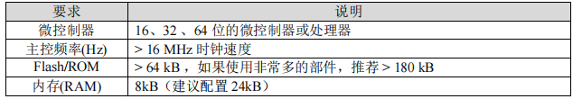
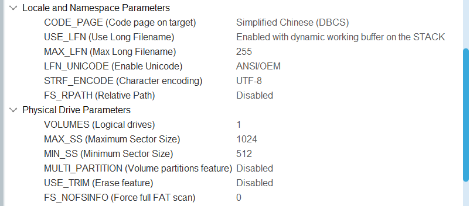

# 4.2. 嵌入式图形化设计入门

# 4.2.1. LVGL 入门

## 4.2.1.1. 基础概念与核心组件

### 4.2.1.1.1. 移植要求



### 4.2.1.1.2. 基础概念

1. 对象（Object）：LVGL 基于面向对象思想，将每个 GUI 组件视为是对象的实例，对象类型有：

   - 按钮（Button）：用于响应用户的点击事件
   - 标签（Label）：用于显示文本信息，支持多种文本格式化选项
   - 图像（Image）：用于显示图片，支持多种图片格式
   - 复选框（CheckBox）：用于表示二元状态，如开/关
   - 列表（List）：用于显示可滚动的项目列表，支持单选和多选
   - 滑块（Slider）：用于选择范围内的值
   - 进度条（Progress Bar）：用于显示任务的进度，支持多种样式和方向
   - 文本框（Text Area）：用于输入和编辑文本
   - 开关（Switch）：用于表示二元状态，如开/关，支持多种样式
     - 以上对象类型就是 LVGL 的核心组件，以下对象类型是 LVGL 的部分高级组件
   - 图片按钮（ImaBtn）：可显示图片的按钮
   - 滚轮（Roller）：可展现多个选项，用户可以通过滚动的形式，从这些选项中选择所需的内容
   - 滚动视图（Scroll）：用于显示可滚动的区域，支持水平和垂直滚动
   - 下拉列表（Dropdown）：用于多选一的场景，点开后展开多个选项，选完后自动收回
   - 线条（Line）：由多个点连接而成，用于修饰界面或者展示数据
   - 圆弧（Arc）：由多个点连接而成，用于修饰界面或者展示数据
   - 图表（Chart）：用于数据可视化
   - 表格（Table）：用于展示结构化数据
   - 消息框（Message Box）：用于显示提示信息和用户交互
   - 键盘（Keyboard）：用于文本输入
   - 日历（Calendar）：用于日期选择和展示
   - 动画（Animations）：用于界面元素的动态效果
   - 菜单（Menu）：多级菜单，命令、子菜单或者分隔条都可包括在菜单之中
   - 刻度（Scale）：刻度尺
   - 窗口（Win）：用于任务的前后台切换、多任务协同处理等场景
   - 加载器（Spinner）：用于提示用户，当前任务正在加载中
   - 微调器（Spinbox）：本质上就是一个文本区域部件，用于精确调节某个参数值
   - 画布（Canvas）：用于选择颜色，支持多种颜色模式
2. 样式（Styles）：定义对象的外观，如颜色、字体、边框等
3. 事件（Event）：对象与用户交互的机制，事件类型有：

   - 点击（Click）
   - 释放（Release）
   - 拖动（Drag）
   - 滚动（Scroll）
     - 以上是输入事件（输入设备触发），以下是对象事件（对象状态变化触发）
   - 值改变（Value_Changed）
   - 焦点获得（Focus）
   - 焦点失去（Defocus）
   - 大小改变（Size_Changed）
4. 布局方式：

   - Fiexbox 布局：弹性布局，子对象可以自动排列、换行、居中、拉伸等，适用于响应式设计
   - Grid 布局：网格布局，手动指定子对象在网格中哪一行哪一列，适用于复杂的界面结构
   - 层叠布局（Z-Stack）：允许组件在 Z 轴上重叠
   - 绝对布局：通过设置坐标精确控制组件位置
5. 布局管理器：

   - 容器：容器是 LVGL 中用于组织和管理子组件的基本布局工具
   - 页面：页面是 LVGL 中用于管理多个子页面的布局工具；每个页面包含自己的布局和组件
   - 列表：用于显示可滚动项目列表的布局工具；列表项可以包含文本、图标等，适用于菜单等场景
6. 属性与样式：

   - 布局属性：包括对齐方式、间距、边距等；可以通过样式设置来调整布局属性
   - 样式设置：用于定义布局的外观，如背景颜色、边框、字体等

## 4.2.1.2. 运行机制与 GUI 实现

### 4.2.1.2.1. 心跳与处理

1. 需要定时运行 void lv_tick_inc(uint32_t tick_period) 函数来维持心跳，如在 RTOS 中开启 Tick 钩子，RTOS 心跳即 LVGL 心跳：

```c
void vApplicationTickHook( void )
 {
     // RTOS每1ms触发Tick中断时调用Tick钩子，在钩子函数中调用LVGL心跳函数
     lv_tick_inc(1);
 }
```

1. 通常每 5ms 调用一次处理函数 uint32_t lv_timer_handler(void) ，注意 RTOS 中 LVGL 只能在一个线程中运行（LVGL 无互斥机制），并分配合适的栈空间给处理函数运行（如 4096 字）

### 4.2.1.2.2. 基础布局实现

1. 初始化 LVGL：

```javascript
void GUI_Init(void)
 {
     // 必须的初始化
     lv_init();
     lv_port_disp_init();
     // 如果有输入设备（如触控）则添加输入初始化
     lv_port_indev_init();
     // 如果有外部存储（如SD卡）并且使用FATFS中间件进行文件管理，则需修改lv_conf.h里的LV_USE_FS_FATFS宏定义下的相关参数，以及在lvgl/src/extra/libs/fsdrv/lv_fs_fatfs.c文件里挂载SD卡和其他初始化操作
 
     _INFO("LVGL Initialized!");
 }
```

1. 创建布局容器：

```cpp
// 创建一个使用Flexbox布局的容器
 lv_obj_t* flex_container = lv_obj_create(lv_scr_act()); // 创建通用对象作容器
 lv_obj_set_size(flex_container, 300, 150);              // 设置容器尺寸
 lv_obj_align(flex_container, LV_ALIGN_TOP_MID, 0, 10);  // 设置容器对齐方式
 lv_obj_set_layout(flex_container, LV_LAYOUT_FLEX);      // 设置容器为Flex布局
 // 创建一个使用Grid布局的容器
 lv_obj_t* grid_container = lv_obj_create(lv_scr_act()); // 父对象为当前屏幕
 lv_obj_set_size(grid_container, 300, 150);              // 对齐方式基于父对象
 lv_obj_align(grid_container, LV_ALIGN_BOTTOM_MID, 0, -10);  // 后两参数为偏移量
 lv_obj_set_layout(grid_container, LV_LAYOUT_GRID);      // 设置容器为Grid布局
```

1. 添加组件：

```cpp
// 添加组件（按钮 + 标签）
 // Flex容器添加3个按钮
 for(int i = 0; i < 3; i++){
     lv_obj_t* btn = lv_btn_create(flex_container);  // 通用对象创建为按钮
     lv_obj_t* label = lv_label_create(btn);         // 通用对象创建为标签
     lv_label_set_text_fmt(label, "Btn %d", i + 1);  // 设置标签文字
 }
 // Grid容器添加4个标签
 for(int i = 0; i < 4; i++){                         
     lv_obj_t* label = lv_label_create(grid_container);  // 父对象为Grid容器
     lv_label_set_text_fmt(label, "Label %d", i + 1);    // 设置标签文字
 }
```

1. 设置布局属性：

```cpp
// 设置布局属性
 // Flex属性
 lv_obj_set_flex_flow(flex_container, LV_FLEX_FLOW_ROW); // 设置Flex布局排列方向
 lv_obj_set_flex_align(flex_container,               // 设置Flex布局对象的对齐方式
                       LV_FLEX_ALIGN_SPACE_EVENLY,   // 主轴（按排列方向，这里x轴）
                       LV_FLEX_ALIGN_CENTER,         // 交叉轴对齐
                       LV_FLEX_ALIGN_CENTER);        // 多行对齐
 // Grid属性
 ./4.2 lv_coord_t col_dsc[] = {LV_GRID_FR(1),       // 第一列宽度占1份
                                LV_GRID_FR(1),       // 第二列宽度占1份，共1+1=2份
                                LV_GRID_TEMPLATE_LAST};  // 结束标志
 ./4.2 lv_coord_t row_dsc[] = {LV_GRID_FR(1),       // 第一行宽度占1份
                                LV_GRID_FR(1),       // 第二行宽度占1份，共1+1=2份
                                LV_GRID_TEMPLATE_LAST};  // 结束标志
 lv_obj_set_grid_dsc_array(grid_container, col_dsc, row_dsc); // 行列规则应用
 for(int i = 0; i < 4; i++){
     lv_obj_t* child = lv_obj_get_child(grid_container, i);  // 获取第i子对象
     lv_obj_set_grid_cell(child,                     // 子对象为标签，设置其位置
                          LV_GRID_ALIGN_CENTER,      // 对应位置上列居中
                          i % 2,                     // 列号
                          1,                         // 跨1列
                          LV_GRID_ALIGN_CENTER,      // 对应位置上行居中
                          i / 2,                     // 行号
                          1);                        // 跨1行
 }
```

1. 交给 RTOS 任务调度，等待用户交互

### 4.2.1.2.3. 事件处理实现

1. 事件处理机制：基于回调函数，当特定事件发生时，LVGL 会调用相应的回调函数进行处理
2. 事件处理流程：

   - 事件传递：当一个事件被触发时，会按照事件传递的顺序，将其传递给相应的对象，按顺序为：
     - 目标对象：事件首先传递给触发事件的对象
     - 父对象：如果目标对象没有处理事件，事件会传递给其父对象
     - 全局事件处理器：如果父对象也没有处理事件，事件会传递给全局事件处理器
   - 事件拦截：对象可以通过拦截事件来阻止其进一步传递；在回调函数中通过返回特定的值来实现
   - 事件优先级：高优先级的回调函数会先于低优先级的回调函数被调用
3. 高级事件处理：

   - 事件过滤器：允许开发者过滤掉不需要处理的事件，从而提高事件处理的效率
   - 事件广播：允许开发者将事件广播给多个对象，从而实现更复杂的事件处理逻辑
   - 事件队列：允许开发者将事件加入队列中，以便在适当的时候进行处理
4. 实现步骤：

   - 实现基础布局后，为每个控件注册相应的事件回调函数，再交给 RTOS 任务调度，等待用户交互

- 注册回调函数及事件回调函数原型：

```c
struct _lv_event_dsc_t* lv_obj_add_event_cb(struct _lv_obj_t *obj, 
                                             lv_event_cb_t event_cb, 
                                             lv_event_code_t filter, 
                                             void *user_data)
     /**
       * @param: 1：要监听事件的对象
       *         2：事件回调函数
       *         3：感兴趣的事件类型
       *         4：用户自定义数据，回调时通过 lv_event_get_user_data() 获取
       */
 void event_callback(lv_event_t* e)
 {
     // ...
     // 回调中可获取触发事件的对象
     lv_obj_t* obj = lv_event_get_target(e);
     // 回调中可获取触发事件的类型
     lv_event_code_t code = lv_event_get_code(e);
 }
```

- 实现举例：

```cpp
void Create_InputPage(void)
 {
     lv_obj_t* page = lv_obj_create(NULL);
     lv_obj_set_size(page, LV_HOR_RES, LV_VER_RES);
     lv_obj_clear_flag(page, LV_OBJ_FLAG_SCROLLABLE);
     // 标题
     lv_obj_t* title = lv_label_create(page);
     lv_label_set_text(title, "Input");
     lv_obj_set_style_text_font(title, &lv_font_montserrat_18, 0);
     lv_obj_align(title, LV_ALIGN_TOP_MID, 0, 15);
     // 输入文本框
     lv_obj_t* textArea = lv_textarea_create(page);
     lv_obj_set_size(textArea, LV_HOR_RES - 40, LV_VER_RES - 100);
     lv_obj_align(textArea, LV_ALIGN_BOTTOM_MID, 0, -20);
     lv_textarea_set_placeholder_text(textArea, "Type here...");
     lv_textarea_set_one_line(textArea, false);
     lv_obj_add_event_cb(textArea, TextAreaCallback, LV_EVENT_ALL, NULL);
     // 键盘
     lv_obj_t* keyboard = lv_keyboard_create(page);
     lv_obj_set_size(keyboard, LV_HOR_RES - 10, 150);
     lv_obj_align(keyboard, LV_ALIGN_BOTTOM_MID, 0, 0);
     lv_obj_add_flag(keyboard, LV_OBJ_FLAG_HIDDEN);
     lv_obj_add_event_cb(keyboard, KeyboardCallback, LV_EVENT_ALL, NULL);;
     current_keyboard = keyboard;
     // 返回
     Create_BackBtn(page);
 
     guiPages[PAGE_INPUT] = page;
 }
 
 void TextAreaCallback(lv_event_t* e)
 {
     lv_event_code_t code = lv_event_get_code(e);
     lv_obj_t* target = lv_event_get_target(e);
 
     if(code == LV_EVENT_FOCUSED){
         lv_obj_scroll_to_view_recursive(target, LV_ANIM_ON);
         lv_obj_clear_flag(current_keyboard, LV_OBJ_FLAG_HIDDEN);
         lv_keyboard_set_textarea(current_keyboard, target);
         current_textarea = target;
     }
     else if(code == LV_EVENT_DEFOCUSED){
         lv_obj_add_flag(current_keyboard, LV_OBJ_FLAG_HIDDEN);
         lv_keyboard_set_textarea(current_keyboard, NULL);
         current_textarea = NULL;
     }
 }
 
 void KeyboardCallback(lv_event_t* e)
 {
     lv_event_code_t code = lv_event_get_code(e);
 
     if(code == LV_EVENT_READY || code == LV_EVENT_CANCEL){
         lv_obj_add_flag(current_keyboard, LV_OBJ_FLAG_HIDDEN);
         lv_keyboard_set_textarea(current_keyboard, NULL);
 
         if(current_textarea){
             lv_indev_reset(NULL, current_textarea);
             current_textarea = NULL;
         }
     }
 }
```

### 4.2.1.2.4. 多级菜单框架

1. 定义页面数组和切换页面栈以及相关操作函数：

```cpp
// 页面切换最大深度
 #define GUI_MAX_DEPTH 4
 // 页面索引枚举，通常格式为：
 typedef enum{
     /* ========== 主界面 ========== */
     PAGE_HOME,
     /* ========== 一级菜单（Home的子页面） ========== */
     PAGE_INPUT, PAGE_LIST, PAGE_CONTROL, PAGE_SCROLL,
     /* ========== 二级菜单 ========== */
     // Input的子页面
     PAGE_..., PAGE_..., PAGE_..., PAGE_..., 
     // List的子页面
     PAGE_..., PAGE_..., PAGE_..., PAGE_..., 
     // Control的子页面
     PAGE_..., PAGE_..., PAGE_..., PAGE_..., 
     // Scroll的子页面
     PAGE_..., PAGE_..., PAGE_..., PAGE_..., 
     /* ========== 三级菜单 ========== */
     // ...的子页面
     ......
     // 结尾，表示页面总数
     PAGE_COUNT
 } GUI_PageIndex_t;
 // 页面数组以及页面切换栈以及栈顶索引，注意栈顶索引初始化为-1
 ./4.2 lv_obj_t* guiPages[PAGE_COUNT];
 ./4.2 lv_obj_t* guiStack[GUI_MAX_DEPTH];
 ./4.2 int guiStackTop = -1;
 // 进入子页面时入栈
 ./4.2 uint8_t GUI_PushPage(lv_obj_t* newPage)
 {
     if(guiStackTop < GUI_MAX_DEPTH - 1){
         guiStack[++guiStackTop] = lv_scr_act();
         lv_scr_load(newPage);
         return 0;
     }
     else{
         _ERROR("GUI stack overflow!");
         return 1;
     }
 }
 // 返回父页面时出栈
 ./4.2 uint8_t GUI_PopPage(void)
 {
     if(guiStackTop >= 0){
         lv_obj_t* prevPage = guiStack[guiStackTop--];
         guiStack[guiStackTop + 1] = NULL;
         lv_scr_load(prevPage);
         return 0;
     }
     else{
         _ERROR("GUI stack underflow!");
         return 1;
     }
 }
```

1. 一个页面里需要进入新页面，定义切换页面回调函数（一般一个页面一个）将旧页面压入栈

```cpp
void HomeBtnCallback(lv_event_t* e)
 {
     // 获取索引
     int index = (int)(uintptr_t)lv_event_get_user_data(e);
     lv_obj_t* newPage = NULL;
     // 判断新页面
     switch(index){
         case PAGE_INPUT:
             newPage = guiPages[PAGE_INPUT];
             break;
         case PAGE_LIST:
             newPage = guiPages[PAGE_LIST];
             break;
         case PAGE_CONTROL:
             newPage = guiPages[PAGE_CONTROL];
             break;
         case PAGE_SCROLL:
             newPage = guiPages[PAGE_SCROLL];
             break;
         default:
             _ERROR("Invalid page index: %d", index);
             return;
     }
     // 进入新页面并入栈
     if(newPage){
         GUI_PushPage(newPage);
     }
     else{
         _ERROR("No page to switch to!");
     }
 }
```

1. 回退方式通常为返回上一级或回到主页面，按需弹出栈即可：

```cpp
// 返回上一级，弹出一次栈
 void BackBtnCallback(lv_event_t* e)
 {
     GUI_PopPage();
 }
 // 返回主页面，一直弹出直到回到主页面
 void BackToHomeBtnCallback(lv_event_t* e)
 {
     while(!GUI_PopPage());
 }
```

1. 创建一个页面包含多个子页面时，通常用 typedef enum 来索引：

```cpp
typedef enum{
     PAGE_HOME,
     // Home的子菜单
     PAGE_INPUT,
     PAGE_LIST,
     PAGE_CONTROL,
     PAGE_SCROLL,
 } GUI_PageIndex_t;
 
 void Create_HomePage(void)
 {
     lv_obj_t* page = lv_obj_create(lv_scr_act());
     lv_obj_set_size(page, LV_HOR_RES, LV_VER_RES);
     lv_obj_clear_flag(page, LV_OBJ_FLAG_SCROLLABLE);
     // 标题
     lv_obj_t* title = lv_label_create(page);
     lv_label_set_text(title, "Home");
     lv_obj_set_style_text_font(title, &lv_font_montserrat_18, 0);
     lv_obj_align(title, LV_ALIGN_TOP_MID, 0, 20);
     // Grid布局下的2x2选项按钮
     const char* btn_names[] = {"Input", "List", "Control", "Scroll"};
     for(int i = 0; i < 4; i++){
         lv_obj_t* btn = lv_btn_create(page);
         lv_obj_set_size(btn, 140, 60);
 
         int col = i % 2;
         int row = i / 2;
         lv_obj_align(btn, LV_ALIGN_CENTER,
                     (col == 0 ? -80 : 80),
                     (row == 0 ? -20 : 60));
 
         lv_obj_t* label = lv_label_create(btn);
         lv_label_set_text(label, btn_names[i]);
         lv_obj_center(label);
         // 传入的参数，对应子页面的第一个开始+i即可创建所有按钮：PAGE_INPUT + i
         lv_obj_add_event_cb(btn, HomeBtnCallback, LV_EVENT_CLICKED, (void*)(uintptr_t)(PAGE_INPUT + i));
     }
     guiPages[PAGE_HOME] = page;
 }
 
 // 上面使用的0是C库中定义的指针转换媒介，通常是int → uintptr_t → void*传入
 // 如这里就是将int类型的索引先转换为uintptr_t，再转换为void*指针
 lv_obj_add_event_cb(btn, HomeBtnCallback, LV_EVENT_CLICKED, 
                     (void*)(uintptr_t)(PAGE_INPUT + i));
 // 再接收时又从void*指针转换为uintptr_t，再转换为int类型
 int index = (int)(uintptr_t)lv_event_get_user_data(e);
 // 原型：typedef unsigned long uintptr_t; 所有平台的指针地址都是unsigned long类型，
 // 例如stm32平台是32位地址，而unsigned long就是32位，以此来确保指针完整
```

## 4.2.1.3.图片显示与内存分配

### 4.2.1.3.1. lv_conf.h 配置

1. 使用 SDRAM 作为 LVGL 内存池

```c
#define LV_MEM_SIZE (16U * 1024U * 1024U)       // 分配SDRAM后16M作内存池
 #define LV_MEM_ADR 0xC1000000                   // 0xC0000000 ~ 0xC1FFFFFF
```

1. 分配简单图层缓冲区（主 + 备用）

```c
#define LV_LAYER_SIMPLE_BUF_SIZE          (1024 * 1024)     // 分配1M
 #define LV_LAYER_SIMPLE_FALLBACK_BUF_SIZE (512 * 1024)      // 分配512KB
```

1. 设置图片缓存数量

```c
#define LV_IMG_CACHE_DEF_SIZE 4                 // 预先缓存4张图片
```

1. 开启 DMA2D

```cpp
#define LV_USE_GPU_STM32_DMA2D 1
 #if LV_USE_GPU_STM32_DMA2D
     /*Must be defined to include path of CMSIS header of target processor
     e.g. "stm32f7xx.h" or "stm32f4xx.h"*/
     #define LV_GPU_DMA2D_CMSIS_INCLUDE "stm32h7xx.h"
```

1. 设置刷新周期（帧率）

```c
#define LV_DISP_DEF_REFR_PERIOD 16              // 60帧
```

1. 分配内存缓冲区

```c
#define LV_MEM_BUF_MAX_NUM 32                   // 32个缓冲区
```

1. 可选：开启监控，实时监控内存使用率和 GPU 使用率

```cpp
/*1: Show CPU usage and FPS count*/
 #define LV_USE_PERF_MONITOR 1
 #if LV_USE_PERF_MONITOR
     #define LV_USE_PERF_MONITOR_POS LV_ALIGN_BOTTOM_RIGHT
 #endif
 
 /*1: Show the used memory and the memory fragmentation
  * Requires LV_MEM_CUSTOM = 0*/
 #define LV_USE_MEM_MONITOR 1
 #if LV_USE_MEM_MONITOR
     #define LV_USE_MEM_MONITOR_POS LV_ALIGN_BOTTOM_LEFT
 #endif
```

### 4.2.1.3.2. 图像处理实现

1. 基本图像显示

```cpp
lv_obj_t* bg_img = lv_img_create(page);             // 创建图片对象
 lv_img_set_src(bg_img, "0:/image/3.png");           // 选择图片源
 lv_obj_set_size(bg_img, LV_HOR_RES, LV_VER_RES);    // 设置图片大小
 lv_obj_align(bg_img, LV_ALIGN_CENTER, 0, 0);        // 设置对齐方式
 lv_obj_set_style_img_opa(bg_img, LV_OPA_80, 0);     // 设置透明度
```

1. 支持的图像格式：

   - **BMP**：位图格式，无损压缩
   - **JPEG**：有损压缩格式，适用于照片
   - **PNG**：无损压缩格式，支持透明度
   - **RAW**：原始像素数据，适用于自定义图像
2. 图像缩放与裁剪

```c
lv_obj_t * img = lv_img_create(lv_scr_act(), NULL);
 lv_img_set_src(img, &imgPath);
 lv_obj_set_pos(img, 10, 10);
 lv_img_set_zoom(img, 150);              // 缩放为150%
 lv_img_set_offset_x(img, 50);           // 裁剪X偏移50像素
 lv_img_set_offset_y(img, 50);           // 裁剪Y偏移50像素
```

1. 图像透明度与混合

```c
lv_obj_t * img = lv_img_create(lv_scr_act(), NULL);
 lv_img_set_src(img, &imgPath);
 lv_obj_set_pos(img, 10, 10);
 lv_obj_set_style_opa(img, LV_OPA_50, LV_PART_MAIN);     // 设置透明度为50%
```

1. 图像旋转与翻转

```c
lv_obj_t * img = lv_img_create(lv_scr_act(), NULL);
 lv_img_set_src(img, &imgPath);
 lv_obj_set_pos(img, 10, 10);
 lv_img_set_angle(img, 45);              // 旋转45度
 lv_img_set_pivot(img, 50, 50);          // 设置旋转中心
```

1. GIF 动画与帧动画

```cpp
// GIF动画
 lv_obj_t * gif = lv_gif_create(lv_scr_act(), NULL);
 lv_gif_set_src(gif, &imgPath);
 lv_obj_set_pos(gif, 10, 100);
 // 帧动画
 lv_obj_t * anim_img = lv_img_create(lv_scr_act(), NULL);
 lv_img_set_src(anim_img, &frame1);
 lv_obj_set_pos(anim_img, 10, 200);
 lv_anim_t a;
 lv_anim_init(&a);
 lv_anim_set_var(&a, anim_img);
 lv_anim_set_values(&a, 0, 2);
 lv_anim_set_exec_cb(&a, (lv_anim_exec_xcb_t)frame_anim_cb);
 lv_anim_set_time(&a, 1000);
 lv_anim_set_repeat_count(&a, LV_ANIM_REPEAT_INFINITE);
 lv_anim_start(&a);
 // 帧动画回调函数
 void frame_anim_cb(lv_obj_t * obj, int value) {
     switch(value) {
         case 0:
             lv_img_set_src(obj, &frame1);
             break;
         case 1:
             lv_img_set_src(obj, &frame2);
             break;
         case 2:
             lv_img_set_src(obj, &frame3);
             break;
     }
 }
 // 动画控制API
 lv_anim_start(anim);            // 启动
 lv_anim_stop(anim);             // 停止
 lv_anim_pause(anim);            // 暂停
```

### 4.2.1.3.3. 图像缓存优化与操作处理

1. 优化图像资源方式：

   - 压缩图像：使用合适的图像格式和压缩率
   - 减少图像数量：尽量复用图像资源
   - 使用图标字体：对于简单的图标，可以使用图标字体代替图像
2. 内存管理

   - 合理管理图像内存，避免内存泄漏和过度占用

   ```c
   ```

lv_img_cache_invalidate_src(&my_image);
lv_img_cache_set_size(10); // 设置缓存大小

```

3. 图形操作与处理

```cpp
lv_obj_t* img = lv_img_create(lv_scr_act(), NULL);
 lv_img_set_src(img, &my_image);
 lv_obj_set_pos(img, 10, 10);                        // 设置图像位置
 
 lv_obj_t* rect = lv_obj_create(lv_scr_act());       // 创建矩形实例
 lv_obj_set_size(rect, 50, 50);                      // 设置大小
 lv_obj_set_pos(rect, 10, 10);                       // 设置位置
 lv_obj_set_style_bg_color(rect, LV_COLOR_RED, 0);   // 背景颜色红色
 
 // 设置灰度滤镜：用灰色 + 半透明叠加
 lv_obj_set_style_img_recolor(img, lv_color_make(128, 128, 128), LV_PART_MAIN);
 lv_obj_set_style_img_recolor_opa(img, LV_OPA_50, LV_PART_MAIN);
 
 lv_obj_set_style_img_opa(img, LV_OPA_70, LV_PART_MAIN);  // 70% 不透明
 
 // 普通叠加
 lv_obj_t * img1 = lv_img_create(lv_scr_act());
 lv_img_set_src(img1, &image1);
 lv_obj_t * img2 = lv_img_create(lv_scr_act());
 lv_img_set_src(img2, &image2);
 lv_obj_align(img2, LV_ALIGN_CENTER, 0, 0);  // 居中叠在上面
 // 加法叠加：让重叠部分变亮
 lv_obj_set_style_blend_mode(img2, LV_BLEND_MODE_ADD, LV_PART_MAIN);
 // 乘法叠加：让重叠部分变暗
 lv_obj_set_style_blend_mode(img2, LV_BLEND_MODE_MULTIPLY, LV_PART_MAIN);
 // 屏幕混合，类似加法但更柔和
 lv_obj_set_style_blend_mode(img2, LV_BLEND_MODE_SCREEN, LV_PART_MAIN);
```

### 4.2.1.3.4. 动画

1.

# 4.2.2. STM32H743 文件系统配置

## 4.2.2.1. CubeMX 配置

### 4.2.2.1.1. SDMMC

1. SDMMC 时钟配置为 240MHz，再 5+1 分频为 40MHz
2. 记得开 NVIC

### 4.2.2.1.2. FATFS

1. 选择引脚可以不设置，直接无视警告
2. 要单独配置 MDMA，选择 SDMMC1 data end
3. 如图：



1. 高级配置里选择 SDMMC1 并开启 DMA

## 4.2.2.2. 代码配置

### 4.2.2.2.1. sdmmc.c

1. 目前来看是 SD 卡或读卡模块问题，无法使用 4B，要设置为 SDMMC_BUS_WIDE_1B
2. 添加 Init 代码：

```c
/* USER CODE BEGIN SDMMC1_Init 2 */
     if(HAL_SD_Init(&hsd1) != HAL_OK){
         _ERROR("SD Initialization Error");
     }
     if(HAL_SD_GetCardState(&hsd1) != HAL_SD_CARD_TRANSFER){
         _ERROR("SD Card Not Ready");
     }
   /* USER CODE END SDMMC1_Init 2 */
```

### 4.2.2.2.2. sd_diskio.c

1. 开启两个 define：

```sql
/* USER CODE BEGIN enableSDDmaCacheMaintenance */
 #define ENABLE_SD_DMA_CACHE_MAINTENANCE  1
 /* USER CODE END enableSDDmaCacheMaintenance */
 
 /*
 * Some DMA requires 4-Byte aligned address buffer to correctly read/write data,
 * in FatFs some accesses aren't thus we need a 4-byte aligned scratch buffer to correctly
 * transfer data
 */
 /* USER CODE BEGIN enableScratchBuffer */
 #define ENABLE_SCRATCH_BUFFER
 /* USER CODE END enableScratchBuffer */
```

1. 补上两个 ret 的初始化（如果没有会报警告，不确定会不会有影响）

```c
int32_t ret = MSD_OK;
   uint8_t ret = MSD_OK;
```

### 42.2.2.3. bsp_driver_sd.c

1. 因为 sd 卡配置改为了 1B，所以这里也要改：

```cpp
__weak uint8_t BSP_SD_Init(void)
 {
   uint8_t sd_state = MSD_OK;
   /* Check if the SD card is plugged in the slot */
   if (BSP_SD_IsDetected() != SD_PRESENT)
   {
     return MSD_ERROR_SD_NOT_PRESENT;
   }
   /* HAL SD initialization */
   sd_state = HAL_SD_Init(&hsd1);
   /* Configure SD Bus width (4 bits mode selected) */
   if (sd_state == MSD_OK)
   {
     /* Enable wide operation */
     if (HAL_SD_ConfigWideBusOperation(&hsd1, SDMMC_BUS_WIDE_1B) != HAL_OK)
     {
       sd_state = MSD_ERROR;
     }
   }
 
   return sd_state;
 }
```

## 4.2.2.3. 挂载文件系统

### 4.2.2.3.1. 裸机

```c
/* USER CODE BEGIN 2 _/_
_     f_mount(&SDFatFS, SDPath, 1);_
_   /_ USER CODE END 2 */
```

### 4.2.2.3.2. RTOS 系统

1. 需要在 RTOS 初始化完成并开始调度后才可以挂载文件系统：

```java
/* USER CODE END Header_StartDefaultTask */
 void StartDefaultTask(void *argument)
 {
   /* USER CODE BEGIN StartDefaultTask */
     // 挂载文件系统并初始化GUI
     f_mount(&SDFatFS, SDPath, 1);
     GUI_Init();
     Create_GUI();
   
   /* Infinite loop */
   for(;;)
   {
     lv_timer_handler();
 
     osDelay(5);
   }
   /* USER CODE END StartDefaultTask */
 }
```

### 4.2.2.3.3. DCache 问题

1. 由于 DCache 会导致 FATFS 数据错误，从而无法读取目录和文件，所以在挂载之前先关闭 DCache

```java
./4.2 void FATFS_Mount_Init(void)  // 将这个函数放到GUI_Init()前
 {
     // 禁用DCache避免FATFS数据不一致
     SCB_DisableDCache();
     // 挂载文件系统
     FRESULT res = f_mount(&SDFatFS, SDPath, 1);
     if(res == FR_OK){
         // 列出根目录内容
         _INFO("==================== Root Directory Contents ====================");
         DIR dir;
         FILINFO fno;
         res = f_opendir(&dir, "0:/");
         if(res == FR_OK){
             while(1){
                 res = f_readdir(&dir, &fno);
                 if(res != FR_OK || fno.fname[0] == 0) break;
                 if(fno.fattrib & AM_DIR){
                     _INFO("[DIR]  %s", fno.fname);
                 }
             }
             f_closedir(&dir);
             _INFO("==================== Directory list complete ====================");
         } 
         else{
             _ERROR("Cannot open root directory: %d", res);
         }
     }
     else{
         _ERROR("SD Card Mount FAILED: %d", res);
     }
 }
```

1. 如何重新开启 DCache 之后再解决（TODO）
